<div align="center">


# Blackstorm Infra

**A GitOps platform to deploy, operate, and recover your applications on Kubernetes.**

[](https://docs.blackstorm.dev/)
[](#quick-start)
[](https://docs.blackstorm.dev/tutorials/)

[](#features)
[](#features)
[](#features)
[](#canary-deployments)
[](#features)
[](#features)
[](#features)
[](#features)
[](#features)
[](#features)
[](#features)
[](#features)
[](#features)
[](#features)
[](#features)
[](#features)
[](#features)
[](#features)
[](#features)
[](#features)
[](#features)

[Features](#features) · [Quick start](#quick-start) · [Architecture](#architecture) · [Applications](#applications) · [Operations](#operations)

</div>

Blackstorm Infra is a Kubernetes platform template that brings together the application lifecycle:
from provisioning clusters and building images to promoting releases, monitoring workloads, and
recovering data. It combines open-source tools with declarative configuration versioned in Git.

This repository manages the platform. Each application keeps its code, pipelines, manifests, and
encrypted secrets in an independent repository. A shared deployment contract lets projects join
the platform without adding a per-application entry to the infrastructure repository.

<p align="center">
  <a href="https://docs.blackstorm.dev/tutorials/promote-a-release-to-production/">
    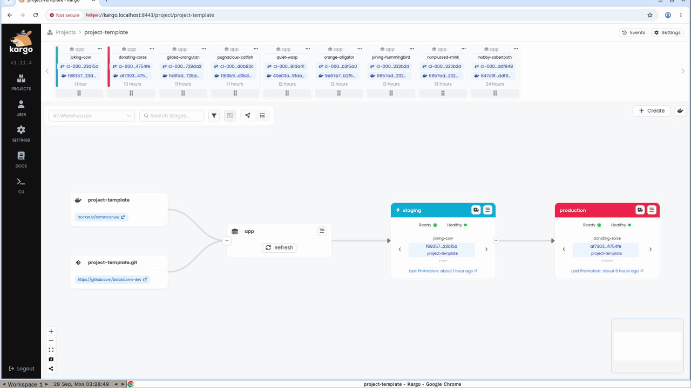
  </a>
</p>

## Features

| | Feature | How |
|---|---|---|
| 🚀 | **Automated local and cloud bootstrap** | mise, Make, lefthook, Terraform, Terragrunt, and Helmfile; kind locally and DigitalOcean Kubernetes in the cloud |
| 🔄 | **GitOps and project auto-discovery** | Argo CD and ApplicationSets |
| 🏃 | **Self-hosted CI with ephemeral runners** | GitHub Actions and Actions Runner Controller (ARC), publishing images to Docker Hub |
| 🚢 | **Automatic staging, one-click promotion, and rollback** | Without rebuilding images, with Kargo and Argo CD |
| 🐤 | **Canary deployments** | Argo Rollouts, progressive replica updates, and timed pauses |
| 🔐 | **Encrypted secrets in Git** | SOPS and age, decrypted in the cluster by sops-secrets-operator; configuration-triggered rollouts with Reloader |
| 🛡️ | **Outbound-only ingress** | Cloudflare Tunnel and `cloudflared` into Envoy Gateway and Gateway API, with no public inbound HTTP/HTTPS ports on the cluster |
| 🌐 | **Automated DNS, TLS, and protected access** | external-dns, cert-manager, and Cloudflare Access |
| 🔑 | **Single sign-on with GitHub** | Dex, for every dashboard |
| 📊 | **Metrics, logs, and traces in Grafana** | Prometheus, Loki, Tempo, and Alloy |
| 🚨 | **Availability checks and alerts** | Gatus and Alertmanager, configurable for Telegram, Teams, and webhooks |
| 💾 | **Backup and restore** | Resources and volumes with Velero, and PostgreSQL with StackGres, stored in DigitalOcean Spaces |
| ♻️ | **Declarative PostgreSQL recovery** | StackGres bootstraps new database clusters from a backup declared in Git |
| 🤖 | **Automated dependency update PRs** | Renovate, and manifest validation with Kustomize, Helm, and kubeconform |
| 🖥️ | **Browser-based operations** | Argo CD, Argo Rollouts, Kargo, Velero UI, and StackGres |

## Quick start

You need:

- Git, Make, Bash, and OpenSSH (`ssh-keygen`)
- [mise](https://mise.jdx.dev/getting-started.html), installed and activated in your shell
- Docker Desktop, for local development

On Windows, run the commands inside Ubuntu on WSL2, with Docker Desktop's WSL integration
enabled. Keep the clone in the Linux filesystem (for example, `~/projects`), rather than `/mnt/c`.
Install the base packages inside Ubuntu before continuing:

```bash
sudo apt-get update
sudo apt-get install -y make git openssh-client curl ca-certificates unzip
```

**1. Clone the repository.**

```bash
git clone --recurse-submodules git@github.com:blackstorm-dev/blackstorm-template.git
cd blackstorm-template
```

**2. Prepare the machine.** Installs tools and hooks, and prepares the age key.

```bash
make init
```

`make init` installs the GitHub CLI through mise. Authenticate it before creating a cluster:

```bash
mise exec -- gh auth login
```

<p align="center">
  <a href="docs/resources/init.png">
    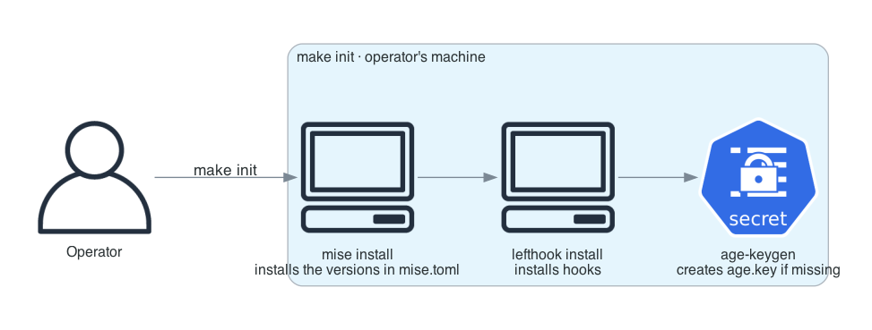
  </a>
</p>

**3. Create the cluster.** Validates, provisions, bootstraps, and waits for the platform.
Edit `live/<env>/config/values.yaml` for your domain, GitHub organization and repository,
administrators, cluster capacity, and backup storage. Terraform and Kubernetes read the same
configuration. Each `live/<env>/secrets/*.example` file contains placeholders and its setup command.
Use `make secrets FILE=<path-without-.example>` to create each required encrypted secret and replace
its placeholders in the editor. `make init` configures the SOPS recipient using your own `age.key`.
Commit the configured values and encrypted secrets before creating the cluster.

```bash
make cluster ENV=local
```

For cloud, use `ENV=prod` with DigitalOcean and Cloudflare credentials.

```bash
make cluster ENV=prod
```

**Make orchestrates → Terraform provisions → Helmfile installs Argo CD and SOPS → Argo manages the cluster.**

<p align="center">
  <a href="docs/resources/bootstrap.png">
    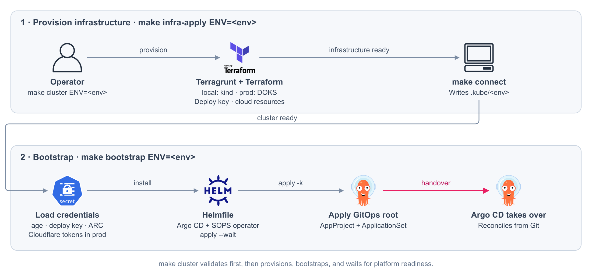
  </a>
</p>

The command prints the Argo URL as soon as it is reachable, waits for the declared platform apps
to become Synced/Healthy, and lists their public URLs.

If the wait times out, resume it. `CLUSTER_TIMEOUT` defaults to 1800 seconds.

```bash
make cluster-wait ENV=local
```

<details>
<summary><b>New installation</b></summary>

Register the public key in `.sops.yaml` and prepare the [encrypted credentials](#secrets).
Backups need Spaces credentials in every environment. Production also requires DigitalOcean and
Cloudflare credentials, and a domain configured in Cloudflare.

Publish environment configuration to the Git revision watched by Argo before creating the cluster.

The GitHub OAuth App used by Dex must allow the callback for the target cluster:
`https://dex.localhost:8443/callback` for local and `https://dex.blackstorm.dev/callback` for prod.
Keep both callbacks when using the same OAuth App across environments.

</details>

<details>
<summary><b>Existing installation</b></summary>

Recover its `age.key` before running `make init`. To connect to an existing cluster, use
`ENV=local` or `ENV=prod`.

```bash
make connect ENV=local
```

</details>

## Architecture

The production architecture combines DOKS, Cloudflare, and Spaces. GitHub Actions orchestrates jobs;
ARC runners execute them in Kubernetes. Each environment enables its components through Git.

<p align="center">
  <a href="docs/resources/overview.png">
    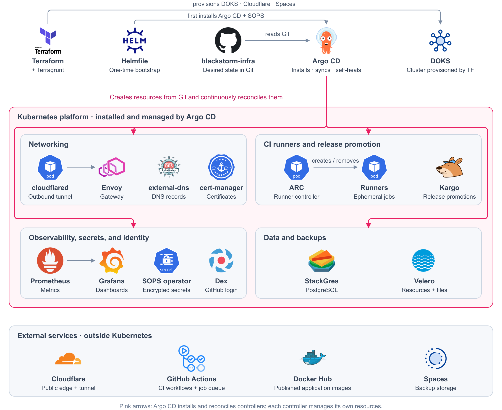
  </a>
</p>

<table>
  <tr>
    <td align="center" width="50%">
      <a href="docs/resources/screenshots/digitalocean-cluster.png">
        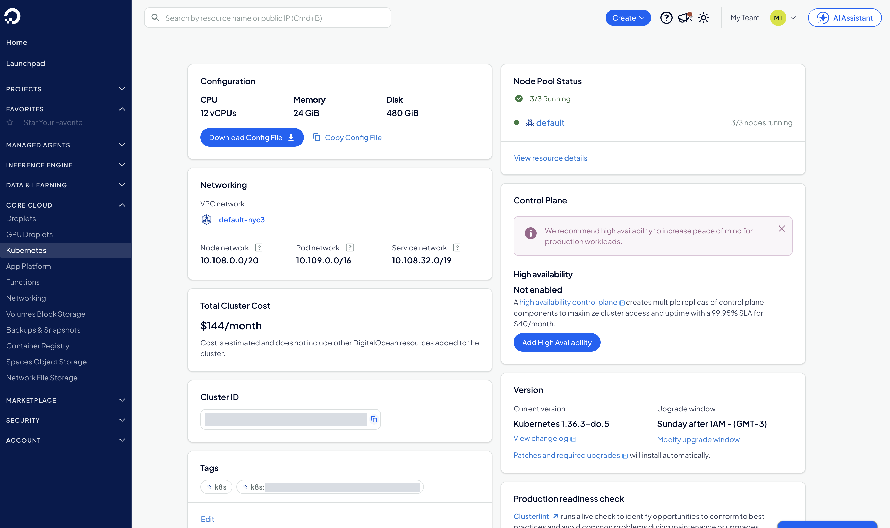
      </a>
      <br>The DOKS cluster that Terraform provisions
    </td>
    <td align="center" width="50%">
      <a href="docs/resources/screenshots/argocd-applications.png">
        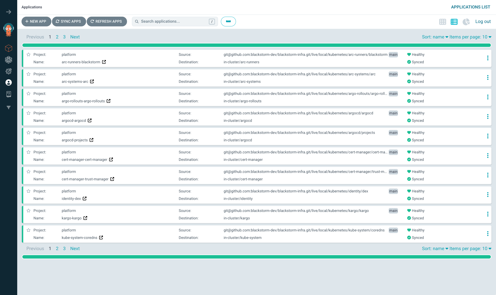
      </a>
      <br>Platform components kept in sync by Argo CD
    </td>
  </tr>
</table>

### Networking and access

Public traffic enters through **Cloudflare**, which provides DNS, HTTPS termination, and access control
for dashboards. **Cloudflare Tunnel** connects that edge to `cloudflared` inside Kubernetes through
outbound connections: the cluster exposes no public inbound HTTP/HTTPS ports or public LoadBalancer
for this ingress path. **Envoy Gateway** receives requests and selects a Service using the `HTTPRoute` hostname.

<p align="center">
  <a href="docs/resources/network.png">
    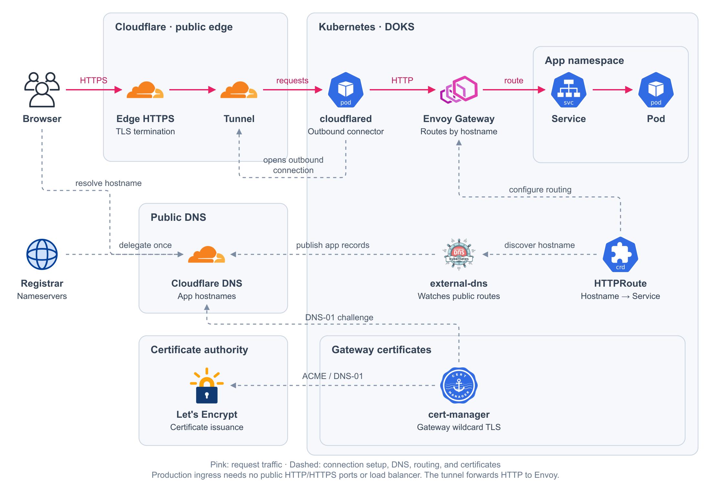
  </a>
</p>

The diagram shows production ingress; Argo CD is one of the published dashboards. Dashboards use
Dex/GitHub for login. Cloudflare Access is optional through `protected_hosts`. Solid lines represent traffic; dotted lines represent DNS
resolution and route configuration.

Locally, ingress uses kind ports and reaches Envoy directly:

`Browser → localhost:8443 → NodePort 30443 → Envoy → Service → Pod`

The `HTTPRoute` selects the Service by hostname; Envoy terminates TLS in the local environment.

cert-manager manages the gateway certificate: self-signed for `*.localhost`, and issued by Let's
Encrypt through Cloudflare DNS-01 for `*.blackstorm.dev`. The `envoy-internal` gateway has its own
ClusterIP Service for internal routes, without publication through Cloudflare Tunnel.

### Secrets

Infrastructure secrets are encrypted in `live/<environment>/secrets/`: `.env` files for providers
and YAML for Kubernetes resources. The private `age.key` and deploy keys
at `live/<environment>/deploy.key` are ignored by Git.

Edit a secret. SOPS opens the editor and encrypts again on save.

```bash
sops live/<environment>/secrets/<file>
```

Argo CD applies encrypted `SopsSecret` resources; sops-secrets-operator decrypts them and creates `Secret`
resources. Actions uses `SOPS_AGE_KEY` to read CI secrets from the application repository. Deployment
secrets include the platform's public key among their recipients.

<p align="center">
  <a href="docs/resources/secrets.png">
    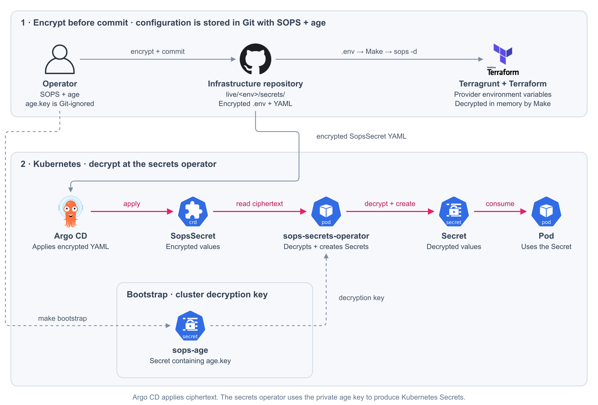
  </a>
</p>

## Applications

### Repositories and environments

A cluster can host multiple projects. Each project has separate `staging` and `production`
namespaces; Argo CD onboarding creates their resources.

<p align="center">
  <a href="docs/resources/onboarding.png">
    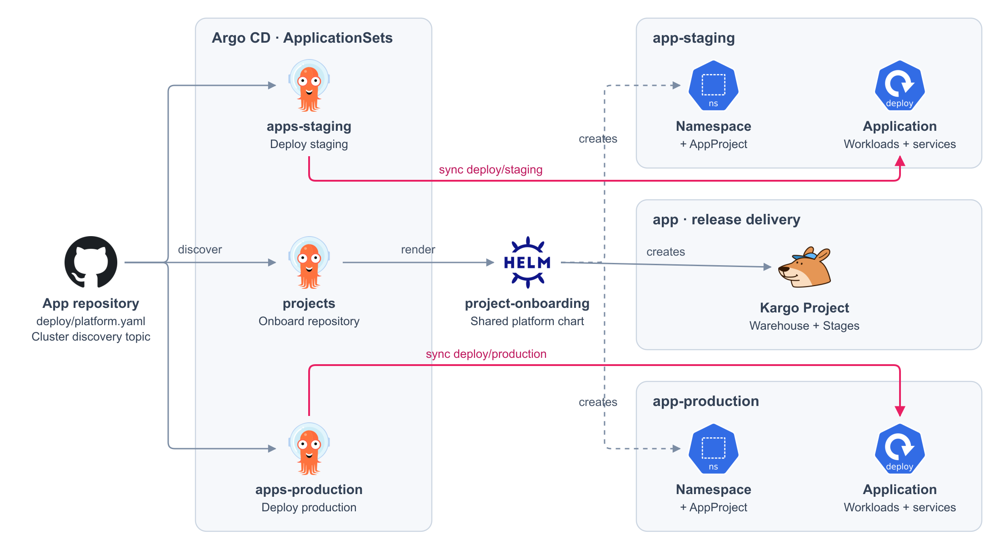
  </a>
</p>

The `apps-staging` and `apps-production` ApplicationSets manage deployments for each environment.
The `projects` ApplicationSet manages onboarding: namespaces, AppProjects, and the Kargo project.
Clusters are configured in `live/<cluster>/`; application environments live in `deploy/<environment>/`.

<table>
  <tr>
    <td align="center" width="50%">
      <a href="docs/resources/screenshots/kargo-project.png">
        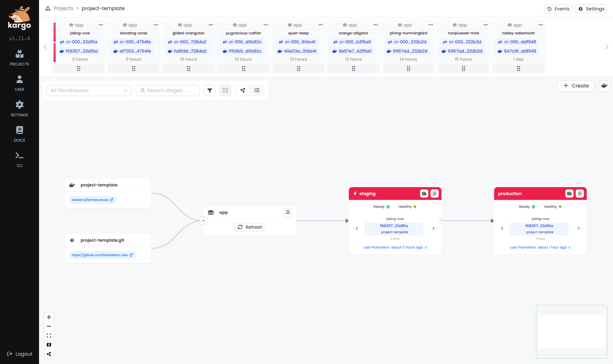
      </a>
      <br>The Kargo project that onboarding creates
    </td>
    <td align="center" width="50%">
      <a href="docs/resources/screenshots/argocd-application.png">
        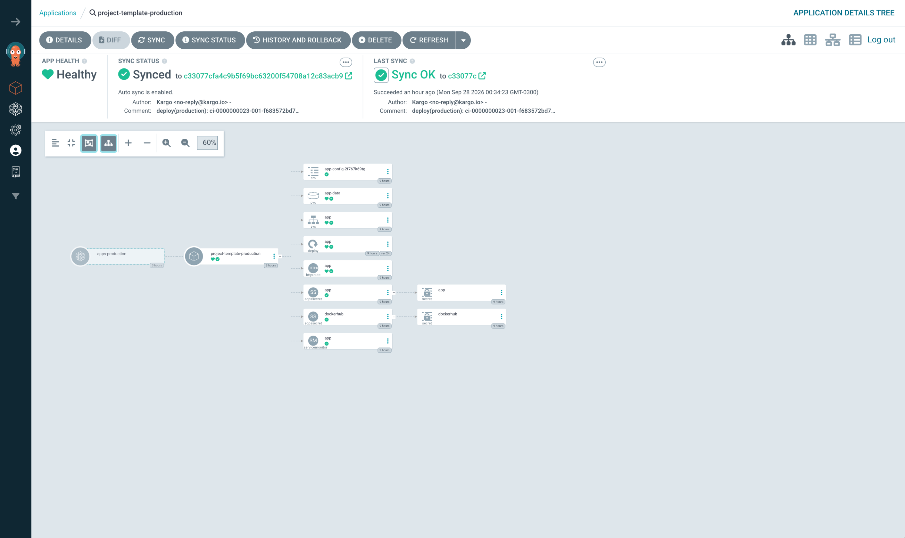
      </a>
      <br>The production application in Argo CD
    </td>
  </tr>
</table>

Discovery selects repositories in `blackstorm-dev` that grant access to the GitOps GitHub App,
have the `blackstorm-deploy` topic for local or `blackstorm-deploy-prod` for DigitalOcean,
use `main` or `master` as their default branch, and declare
their contract in `deploy/platform.yaml`.

Use one discovery topic per repository: each cluster runs its own Kargo controller. Before moving
a project to DigitalOcean, configure its public hostnames, storage, and backup paths for that cluster.

Repository names must contain 1–50 characters: start with a lowercase letter, use lowercase letters,
digits, or hyphens, and not end with a hyphen.

Application repositories contain code, tests, Dockerfiles, manifests, and encrypted secrets. Infrastructure
maintains the controllers and shared onboarding contract. Projects that follow this contract are
discovered without adding a per-application entry to this repository.

[project-template](https://github.com/blackstorm-dev/blackstorm-project-template) contains the sample application
and is included as a Git submodule at `projects/project-template/`, pinned to a specific commit.
For an existing clone, download it with:

```bash
git submodule update --init --recursive
```

To start your own application, select **Use this template** on its GitHub repository and clone
the new repository into `projects/<your-app>/`. Other directories under `projects/` remain ignored.
The template repository is currently private; cloning the submodule requires GitHub access to it.

### Continuous integration

CI runs on ephemeral ARC runners: each job gets its own runner, which is removed when the job finishes.
Each application's workflow defines its builds and checks.

<p align="center">
  <a href="docs/resources/ci.png">
    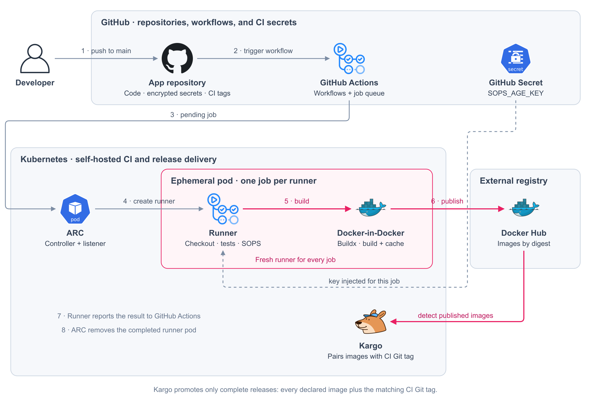
  </a>
</p>

<p align="center">
  <a href="docs/resources/screenshots/github-actions-run.png">
    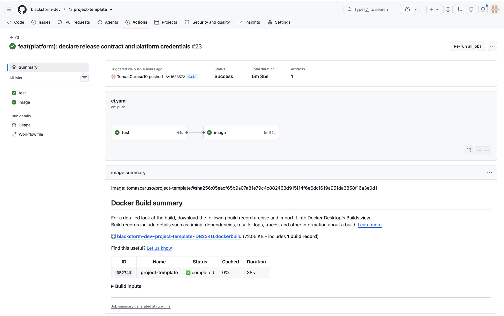
  </a>
  <br>A CI run: tests, then the image published by digest
</p>

### Promotion and rollback

Kargo associates published images with their configuration commit. Staging receives automatic promotions;
production receives the same release through manual promotion, without rebuilding it.

<p align="center">
  <a href="https://docs.blackstorm.dev/tutorials/promote-a-release-to-production/">
    
  </a>
</p>

<p align="center">
  <a href="docs/resources/cd.png">
    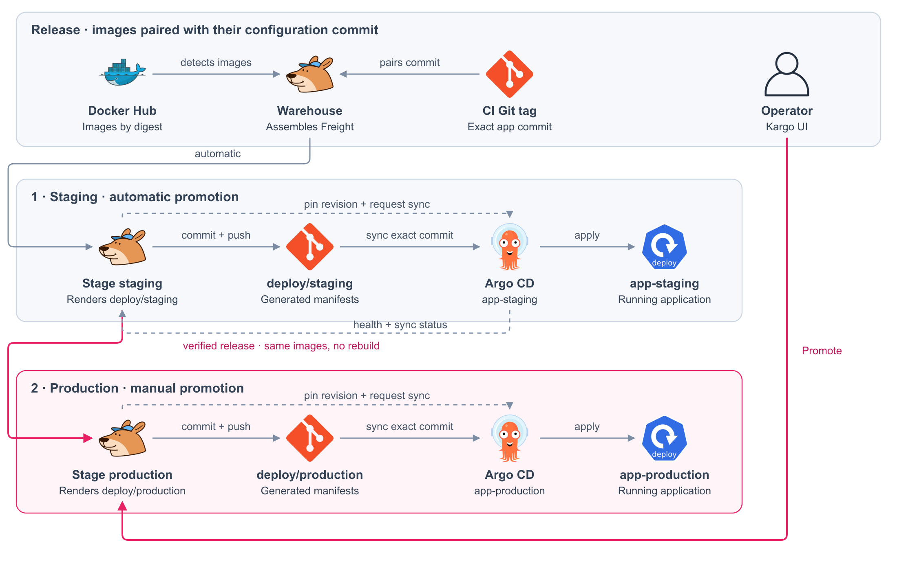
  </a>
</p>

Kargo renders manifests from the validated commit and publishes them to deployment branches.
Argo CD synchronizes the generated commit for each promotion. Configuration changes also go through CI;
when only `deploy/` changes, the validated image is reused.

Rollback means promoting an earlier release, restoring its image and configuration.
File and database recovery is handled by the backup systems.

<p align="center">
  <a href="https://docs.blackstorm.dev/tutorials/roll-production-back-to-an-earlier-release/">
    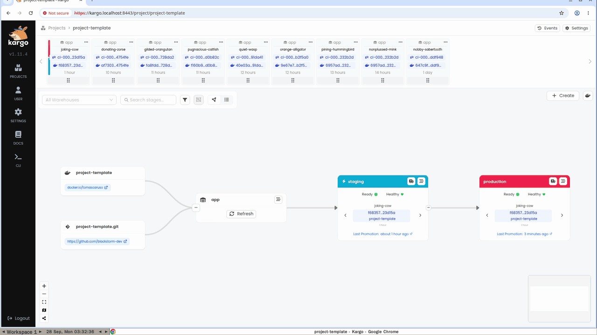
  </a>
</p>

### Canary deployments

Kargo promotes a release to an environment, Argo CD applies its manifests, and **Argo Rollouts**
controls the gradual update of workloads declared as `Rollout` resources. Applications opt in by
replacing a `Deployment` with a `Rollout` and defining their canary steps in Git.

The canary strategy updates replicas in stages, keeping the stable version alongside the new one
during the transition. Each application defines its own weights and pauses; the included example uses:

| Step | What happens |
|---|---|
| **50% canary** | Adjust the replica balance toward an even split between stable and canary |
| **Pause for 2 minutes** | Hold that balance while operators inspect the rollout and application health |
| **100% canary** | Continue the update to the new version after the pause |

The [Argo Rollouts dashboard](https://rollouts.blackstorm.dev), protected by GitHub login through Dex,
shows rollout progress. Grafana and Gatus provide the application's metrics, logs, and availability
alongside it.

<p align="center">
  <a href="docs/resources/tutorials/canary-deployment.gif">
    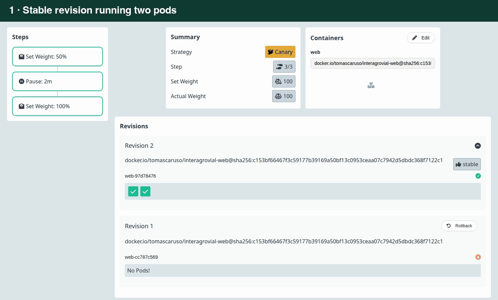
  </a>
</p>

[Configure a canary deployment →](docs/developers/releases.md#roll-out-gradually)

## Operations

### Observability

Alloy collects logs and receives application traces, forwarding them to Loki and Tempo. Prometheus
collects metrics, Gatus checks availability, and Grafana brings together queries and dashboards.
Alertmanager routes alerts to configured receivers; the channels shown in the diagram are integration options.

<p align="center">
  <a href="docs/resources/observability.png">
    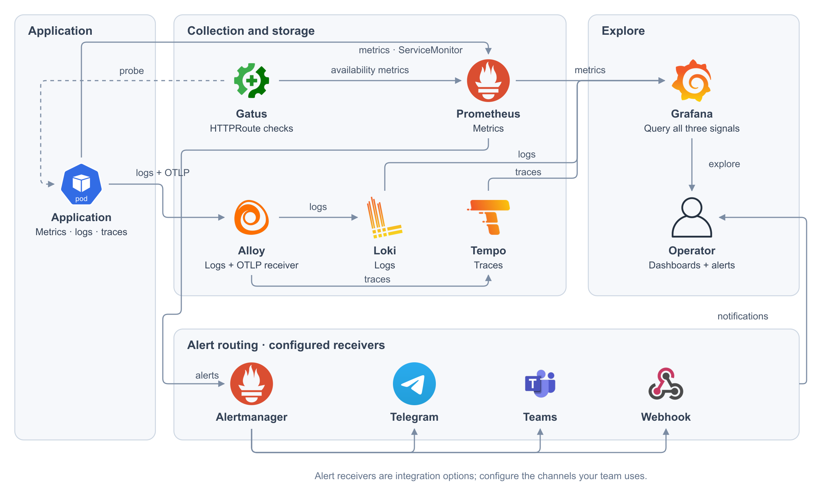
  </a>
</p>

<table>
  <tr>
    <td align="center" width="50%">
      <a href="docs/resources/screenshots/grafana-namespace-resources.png">
        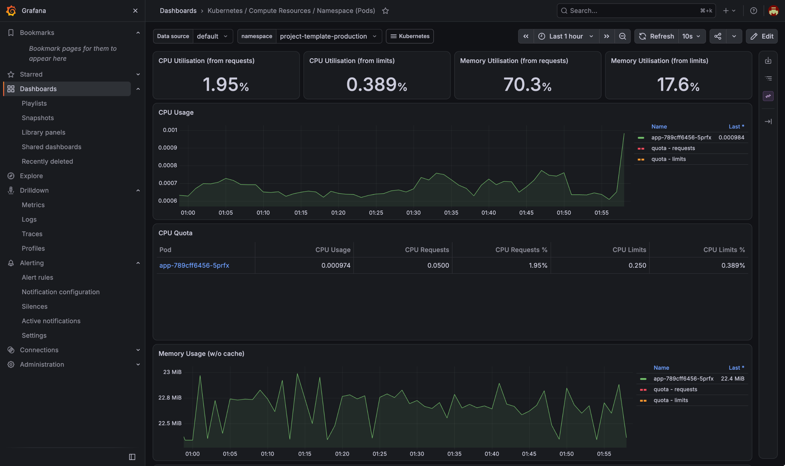
      </a>
      <br>Metrics by namespace in Grafana
    </td>
    <td align="center" width="50%">
      <a href="docs/resources/screenshots/grafana-logs.png">
        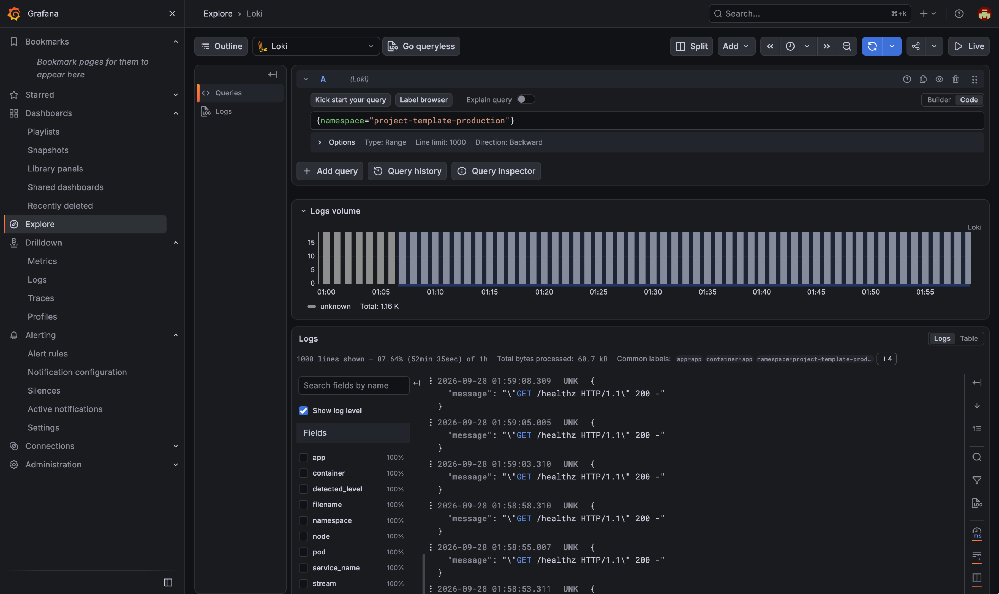
      </a>
      <br>Application logs from Loki
    </td>
  </tr>
  <tr>
    <td align="center" width="50%">
      <a href="docs/resources/screenshots/grafana-availability.png">
        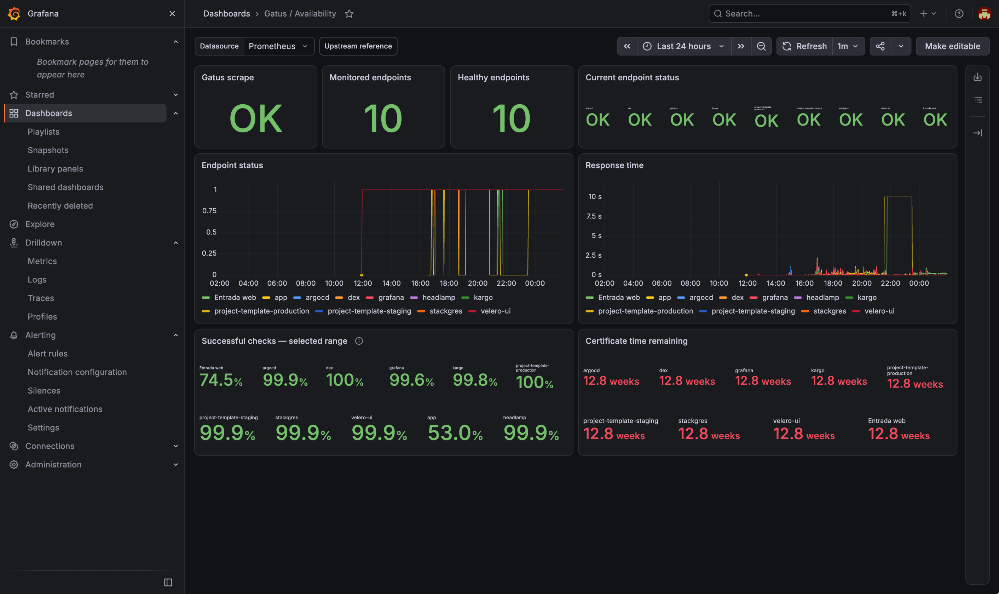
      </a>
      <br>Availability and certificates in Grafana
    </td>
    <td align="center" width="50%">
      <a href="docs/resources/screenshots/gatus.png">
        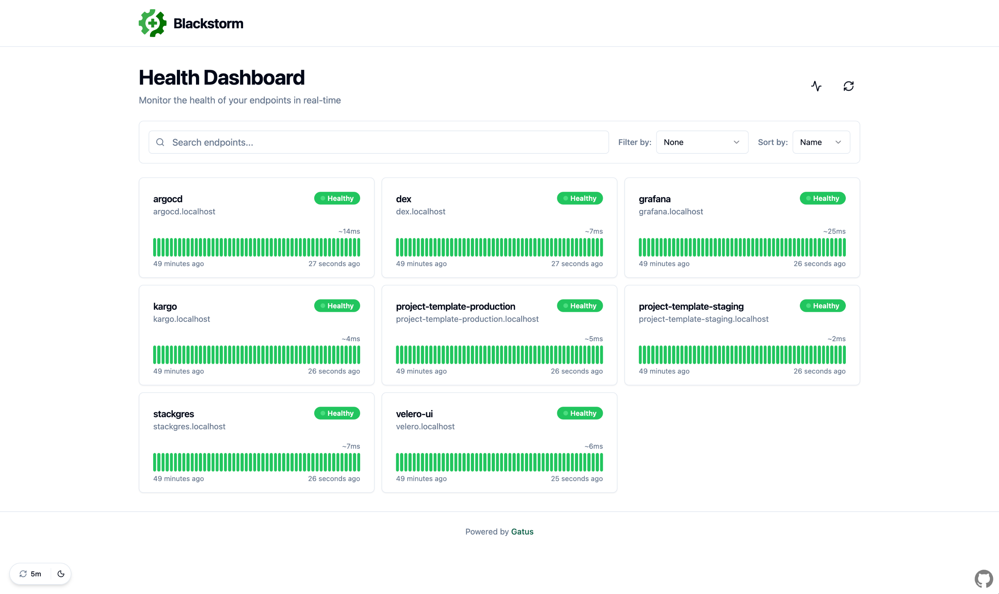
      </a>
      <br>Health of every published route in Gatus
    </td>
  </tr>
</table>

### Persistence and recovery

<p align="center">
  <a href="docs/resources/recovery.png">
    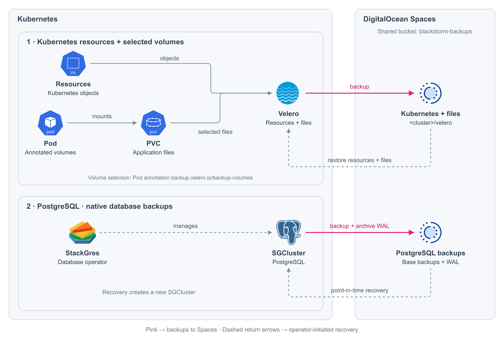
  </a>
</p>

Velero backs up Kubernetes resources and volumes listed in the Pod's `backup.velero.io/backup-volumes`
annotation. StackGres manages PostgreSQL through `SGCluster` resources and performs native database
backups. Spaces provides storage for both.

<table>
  <tr>
    <td align="center" width="50%">
      <a href="docs/resources/screenshots/velero-ui.png">
        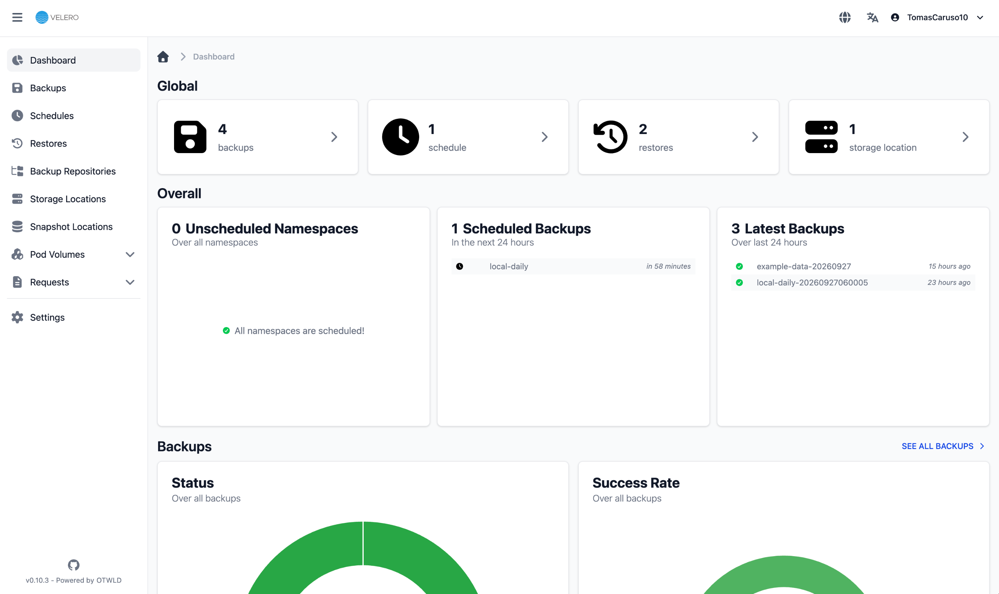
      </a>
      <br>Backups, schedules, and restores in Velero UI
    </td>
    <td align="center" width="50%">
      <a href="docs/resources/screenshots/stackgres.png">
        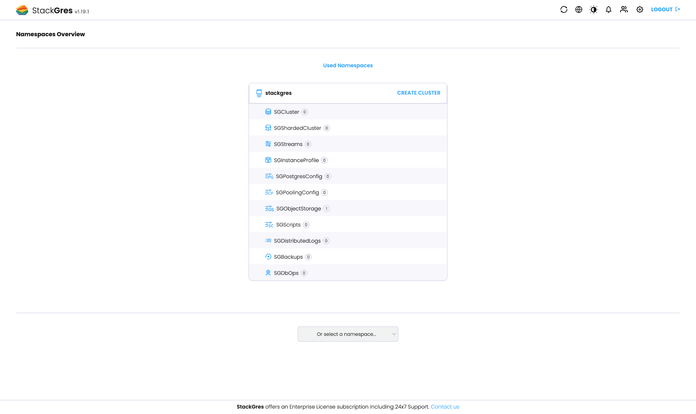
      </a>
      <br>PostgreSQL resources in StackGres
    </td>
  </tr>
</table>

### Dependency updates

Renovate proposes version updates through PRs. The infrastructure workflow renders and validates manifests
when changes affect its configured paths. Merging is manual; Argo synchronizes Kubernetes changes.
Tooling and Terraform changes require their respective execution steps and are not applied by Argo.

<p align="center">
  <a href="docs/resources/renovate.png">
    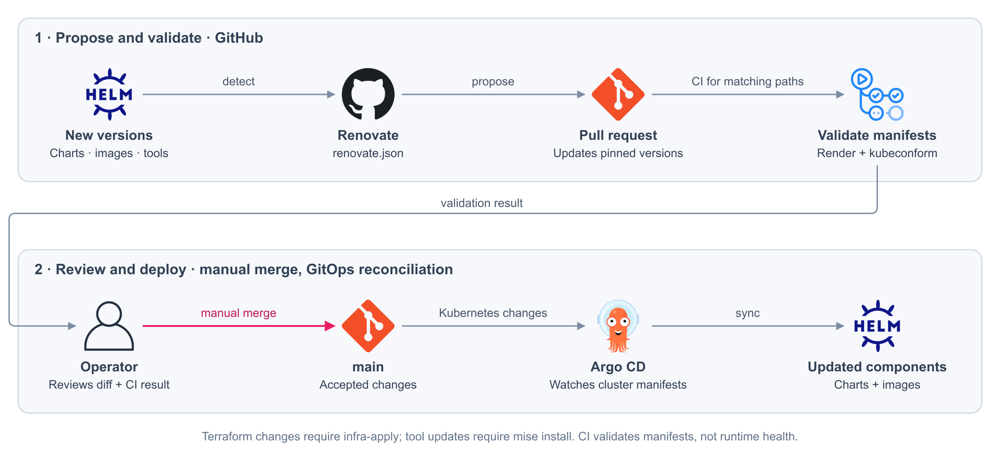
  </a>
</p>

### Local interfaces

| Interface | URL |
|---|---|
| Argo CD | https://argocd.localhost:8443/ |
| Kargo | https://kargo.localhost:8443/ |
| Grafana | https://grafana.localhost:8443/ |
| Gatus | https://gatus.localhost:8443/ |
| Velero UI | https://velero.localhost:8443/ |
| StackGres | https://stackgres.localhost:8443/ |

Argo CD, Kargo, Grafana, Gatus, Velero UI, and StackGres use GitHub login through Dex.

<p align="center">
  <a href="docs/resources/identity.png">
    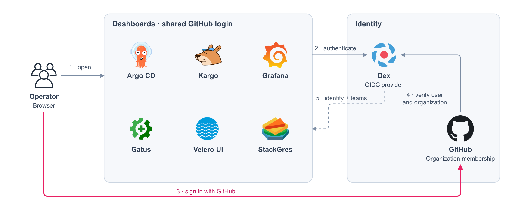
  </a>
</p>

### Operational commands

`ENV` selects a directory under `live/`. `UNIT` restricts Terragrunt to a single unit; without it,
Terragrunt operates on all units in the environment.

Connect to an existing cluster. Recover its `age.key` and environment credentials first.

```bash
make connect ENV=local
```

Plan and apply the infrastructure.

```bash
make infra-plan ENV=prod UNIT=cluster
make infra-apply ENV=prod UNIT=cluster
```

Run only the bootstrap, on a cluster that already exists.

```bash
make bootstrap ENV=local
```

Check the cluster.

```bash
kubectl --context local get nodes
kubectl --context local -n argocd get applications
```

Destroy the cluster.

```bash
make infra-destroy ENV=<environment> UNIT=cluster
```

## Contributing

| Step | What checks it |
|---|---|
| Commit | The Git hooks installed by `make init`: secrets are encrypted, Terraform and Terragrunt files are formatted |
| Pull request | The `Validate manifests` workflow renders and validates the Kubernetes manifests |
| Merge | Manual; Argo CD synchronizes the change |
