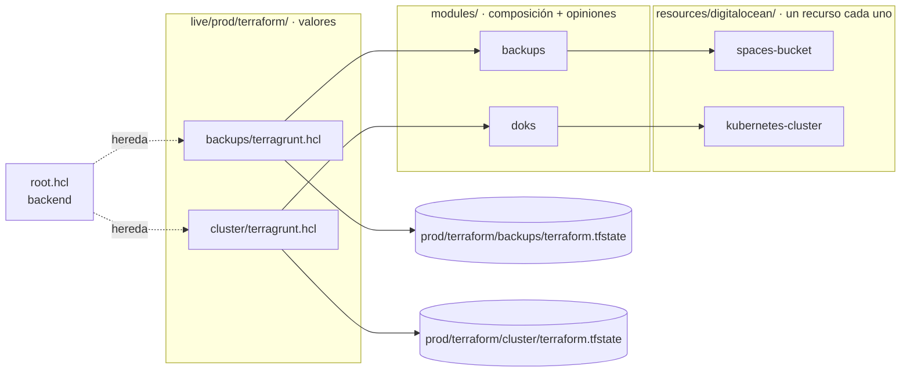
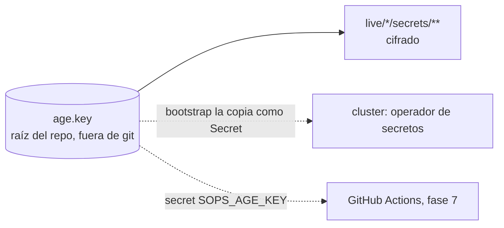
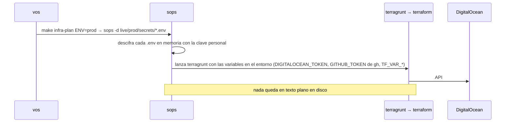
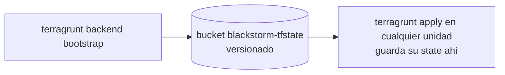

# 01 · Secretos y tooling

## 1. Qué existe

```
blackstorm-cluster/
├── age.key                    # LA clave de sops. make init la genera; ignorada por git; hacele backup
├── mise.toml                  # versiones fijas + KUBECONFIG y SOPS_AGE_KEY_FILE dentro del repo
├── .kube/                     # kubeconfigs generados por `make connect` (ignorado por git)
├── .sops.yaml                 # qué se cifra, con qué clave
├── .lefthook.toml             # pre-commit: nada sin cifrar, terraform fmt, terragrunt hcl fmt
├── terraform/                 # planos, sin entornos
│   ├── resources/             # un recurso por carpeta, sin opiniones: todo es variable
│   │   ├── digitalocean/{spaces-bucket,kubernetes-cluster}/
│   │   ├── github/deploy-key/
│   │   └── kind/cluster/
│   └── modules/               # cómo armamos nosotros cada cosa: qué resources, cómo se conectan, opiniones fijas
│       ├── backups/           # spaces-bucket privado, sin versionado
│       ├── doks/              # kubernetes-cluster sin HA, parches domingos 04:00
│       ├── kind/              # 1 nodo, 80/443 → localhost:8080/8443
│       └── argocd/            # deploy key de solo lectura en GitHub
└── live/                      # lo que existe, por entorno
    ├── root.hcl               # backend del state (Spaces), heredado por todas las unidades
    ├── prod/
    │   ├── terraform/         # una unidad por cosa, un state por unidad: backups, cluster, argocd
    │   ├── secrets/           # digitalocean.env (cifrado)
    │   └── deploy.key         # llave con la que este cluster lee el repo (gitignored; la genera make)
    └── local/
        ├── terraform/         # root.hcl propio (state en disco), cluster, argocd
        └── secrets/           # vacío: local no habla con ningún proveedor
```



Algo nuevo = una carpeta en `modules/` que combina `resources/` existentes (o uno nuevo) y fija las
opiniones, más una unidad en `live/<env>/terraform/` con los valores. Analogía Bicep: `resources/` = módulos de un
recurso, `modules/` = `main.bicep`, `live/` = `.bicepparam`.

Terragrunt copia `terraform/` a `.terragrunt-cache/`, genera `backend.tf` en el módulo y ahí corre
Terraform. `init` es automático.

## 2. La clave

Una sola: `age.key` en la raíz del repo, ignorada por git. Todo `secrets/` está cifrado para su pública
(que está en `.sops.yaml`). Quien tiene el archivo, lee; quien no, no.



- `make init` la genera si no existe. mise setea `SOPS_AGE_KEY_FILE` para que sops la encuentre.
- Máquina nueva o dev nuevo: copiar el archivo. Perderlo: nada se descifra. **Backup fuera del repo.**

## 3. Cómo llega un secreto a Terraform



## 4. State remoto

El bucket `blackstorm-tfstate` no es un recurso de Terraform: lo administra Terragrunt según
`remote_state` en `root.hcl`. Se crea una sola vez:



Sin lock de state (Spaces no lo soporta): un solo operador a la vez.

## 5. Comandos

```bash
# activar mise en la shell (una vez, en ~/.zshrc)
eval "$(mise activate zsh)"

# en el repo: instala las versiones de mise.toml y activa los hooks
mise install
lefthook install

# editar un secreto (abre el editor, re-cifra al guardar). Terraform lee variables de entorno:
#   credencial de provider → el nombre que el provider espera (DIGITALOCEAN_TOKEN, GITHUB_TOKEN, CLOUDFLARE_API_TOKEN)
#   cualquier otro valor  → TF_VAR_<nombre>, que en el .tf es var.<nombre>
sops live/prod/secrets/digitalocean.env

# bucket del state (una sola vez)
make infra-plan ENV=prod   # la primera vez, con --backend-bootstrap: crea el bucket del state

# plan / apply. ENV obligatorio; sin UNIT corre todas las unidades del entorno en orden de dependencias.
# make imprime el comando real antes de correrlo. apply siempre pide confirmación.
make infra-plan  ENV=prod UNIT=cluster
make infra-apply ENV=prod UNIT=cluster
make infra-plan  ENV=prod          # carga live/prod/secrets/*.env y corre terragrunt run --all plan --working-dir live/prod/terraform
make infra-apply ENV=local         # cluster kind en Docker; sin sops porque local no tiene secretos
kubectl --context kind-blackstorm-local get nodes

# kubectl: el repo genera el kubeconfig de cada cluster (output de Terraform) y mise lo pone en KUBECONFIG.
# doctl necesita el token en su config local para la credencial de prod (una vez por máquina):
sops exec-env live/prod/secrets/digitalocean.env 'sh -c "doctl auth init -t \$DIGITALOCEAN_TOKEN"'
make init                          # preparar la máquina
make connect ENV=prod              # .kube/prod, cluster existente
make infra-apply ENV=local         # crea el cluster local y te deja conectado (.kube/local)

kubectl get nodes                  # local (contexto actual dentro del repo)
kubectl --context prod get nodes   # prod, siempre explícito

# formato
terraform fmt -recursive terraform
terragrunt hcl fmt --working-dir terraform

```

## 6. Operación

| Situación | Qué hacer |
|---|---|
| Máquina nueva / dev nuevo | copiar `age.key` a la raíz del repo → `make init` |
| Rotar el token de DO | generar uno nuevo en el panel → `sops live/prod/secrets/digitalocean.env` → revocar el viejo. Las versiones anteriores del archivo siguen en git: rotar, no solo re-cifrar |
| Perdí `age.key` | `live/*/secrets/` es irrecuperable. `age-keygen -o age.key`, su pública a `.sops.yaml`, tokens nuevos, re-cifrar todo |
| El hook rechaza un commit | el archivo está en texto plano: `sops -e -i <archivo>` |
| Ver qué versiones usa el repo | `mise ls` |
