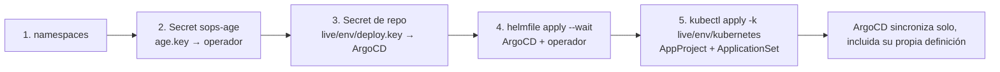
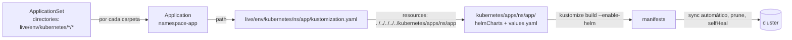

# 02 · ArgoCD

## 1. Qué existe

```
bootstrap/helmfile.yaml                      # ArgoCD + sops-secrets-operator: lo que se instala antes de que exista GitOps
kubernetes/apps/<namespace>/<app>/           # definición de cada app de la plataforma (kustomize helmCharts + values), una vez
live/<env>/kubernetes/
├── appproject.yaml                          # proyecto "platform": puede tocar todo el cluster
├── applicationset.yaml                      # una Application por live/<env>/kubernetes/<namespace>/<app>/
└── <namespace>/<app>/kustomization.yaml     # "esta app corre en este cluster" + patches del entorno
```

## 2. El huevo y la gallina: bootstrap

ArgoCD instala desde git, pero alguien tiene que instalar ArgoCD. `make bootstrap ENV=<env>`, una vez por cluster:



Cada paso es idempotente: se puede correr las veces que haga falta.

## 3. Cómo llega una app al cluster



- ArgoCD se gestiona a sí mismo: `kubernetes/apps/argocd/argocd/values.yaml` es el mismo archivo que usó helmfile.
  Los dos renderizan lo mismo → sin diff. Cambiar values o versión del chart = commit; ArgoCD se actualiza solo.
- Helmfile no se vuelve a usar después del bootstrap.

## 4. Recetas

| Quiero | Hago |
|---|---|
| Que una app nueva corra en un cluster | `kubernetes/apps/<ns>/<app>/{kustomization,values}.yaml` (chart + values) y `live/<env>/kubernetes/<ns>/<app>/kustomization.yaml` con `resources: [../../../../../kubernetes/apps/<ns>/<app>]` → commit → aparece sola |
| Que una app deje de correr en un cluster | borrar `live/<env>/kubernetes/<ns>/<app>/` → commit → ArgoCD la desinstala (prune) |
| Cambiar algo solo en un cluster | patches en `live/<env>/kubernetes/<ns>/<app>/kustomization.yaml` |
| Ver el panel | local: https://argocd.localhost:8443, login con GitHub vía Dex; prod: https://argocd.blackstorm.dev (detrás de Cloudflare Access). |
| Ver el estado | `kubectl --context <env> -n argocd get applications` |
| Forzar a ArgoCD a releer el repo | `kubectl -n argocd annotate applicationset platform argocd.argoproj.io/application-set-refresh=true --overwrite` (si no, revisa cada 3 min) |
