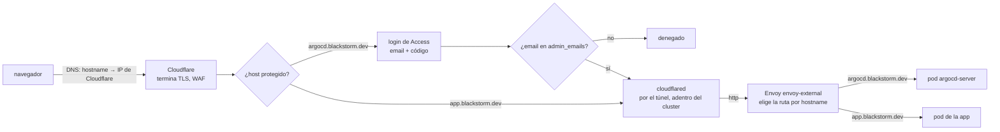
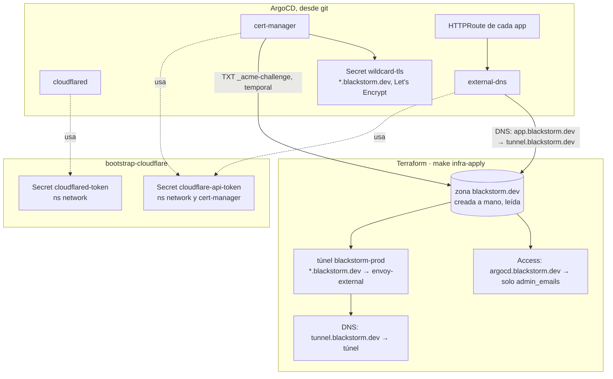

# 03 · Red y DNS

## 1. Qué existe

```
terraform/modules/cloudflare/                # zona (lectura), túnel, registro tunnel.<dominio>, Access por host protegido
kubernetes/apps/network/
├── envoy-gateway/                           # el controlador: crea un Envoy por cada Gateway
├── gateways/                                # dos puertas: envoy-external (pública) y envoy-internal; EnvoyProxy de cada una
├── cloudflared/                             # el otro extremo del túnel, dentro del cluster (2 réplicas)
└── external-dns/                            # un registro DNS por cada HTTPRoute de la puerta pública
kubernetes/apps/cert-manager/                # emite el certificado wildcard de las puertas
live/<env>/kubernetes/network/gateways/      # certificado del entorno; local: patch a NodePort; prod: destino del DNS (el túnel)
live/<env>/kubernetes/cert-manager/          # ClusterIssuer: local selfsigned, prod Let's Encrypt (DNS-01 por Cloudflare)
```

## 2. El camino de una request (prod)

Dos ejemplos: `https://argocd.blackstorm.dev` (protegido) y `https://app.blackstorm.dev` (público).



- La respuesta vuelve por el mismo camino hasta el navegador.
- El hostname decide en las dos puntas: Cloudflare, si pide Access; Envoy, a qué pod va. Una request a
  `app.blackstorm.dev` no puede llegar a `argocd-server`.
- El cluster no tiene IP pública ni LoadBalancer de DigitalOcean: cloudflared abre las conexiones hacia afuera y
  Cloudflare las usa para entrar. TLS lo termina Cloudflare; adentro del cluster va http.
- Balanceo hay igual: Cloudflare reparte entre las conexiones del túnel (2 cloudflared × 4), Envoy entre las
  réplicas de cada app.
- En local no hay túnel ni Access: el navegador va directo a `https://*.localhost:8443` (NodePort de kind) y Envoy
  termina TLS con un certificado autofirmado.

## 3. Quién crea qué



- external-dns solo mira la puerta con label `external-dns: enabled` (la pública) y apunta todo al destino de la
  anotación `external-dns.kubernetes.io/target` de esa puerta: el nombre estable del túnel. El ID del túnel no está en git.
- external-dns marca sus registros con un TXT de dueño (`blackstorm`): crea y borra solo los suyos.

## 4. Recetas

| Quiero | Hago |
|---|---|
| Exponer una app | un `HTTPRoute` en su namespace: `parentRefs: envoy-external/network`, `hostnames: [app.blackstorm.dev]`, `backendRefs` a su Service. Sin `sectionName`: la ruta cuelga de http y https. Commit → DNS y certificado aparecen solos |
| Que solo yo entre | sumar el host a `protected_hosts` en `live/prod/terraform/cloudflare/terragrunt.hcl` → `make infra-apply ENV=prod UNIT=cloudflare` |
| Que otra persona entre a algo protegido | su email en `admin_emails` (misma unidad). Gratis hasta 50 usuarios |
| Algo solo interno | `HTTPRoute` a `envoy-internal`: no tiene DNS público ni túnel |
| Ver el túnel | Cloudflare → Zero Trust → Networks → Tunnels; en el cluster `kubectl --context prod -n network logs deploy/cloudflared` |
| Ver qué DNS creó | `kubectl --context prod -n network logs deploy/external-dns` |
| Ver el certificado | `kubectl --context prod -n network get certificate` (Ready) ; `describe` si no |
