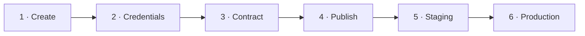

# Your first release

From an empty repository to production, in one sitting.



!!! abstract "Before you start"

    | You need | Check |
    |---|---|
    | GitHub CLI, signed in | `gh auth status` |
    | SOPS and age | `sops --version && age --version` |
    | A private Docker Hub repository named like your project | Docker Hub |
    | A token for it with read and write permission | Docker Hub |

## 1. Create the repository

```bash
gh repo create blackstorm-dev/my-app --private \
  --template blackstorm-dev/project-template --clone
cd my-app
make init # (1)!
```

1.  Creates your key and uploads it to GitHub as `SOPS_AGE_KEY`.

## 2. Store your credentials

```bash
gh variable set DOCKERHUB_NAMESPACE --body '<namespace>'
make secrets FILE=secrets/dockerhub.env # (1)!
make secrets FILE=secrets/platform/dockerhub.yaml # (2)!
make secrets FILE=deploy/staging/secrets/dockerhub.yaml # (3)!
make secrets FILE=deploy/production/secrets/dockerhub.yaml
```

1.  CI uses it to publish your image.
2.  Kargo uses it to find your releases.
3.  The cluster uses it to download your image.

Each command opens your editor. Replace the values and save. Details in [Secrets](secrets.md).

## 3. Declare what you release

```yaml title="deploy/platform.yaml" hl_lines="3 4"
releaseFormat: commit-sha
images:
  - repository: docker.io/<namespace>/my-app
    name: <namespace>/my-app
environments:
  staging:
    path: deploy/staging
    promotion: automatic
  production:
    path: deploy/production
    promotion: manual
    from: staging
```

Set the hostnames in `deploy/staging/kustomization.yaml` and `deploy/production/kustomization.yaml`:

```yaml hl_lines="3"
spec:
  hostnames:
    - my-app-staging.localhost
```

## 4. Publish

```bash
gh repo edit --add-topic blackstorm-deploy # (1)!
git add -A && git commit -m "feat: first release" && git push
gh run watch --exit-status # (2)!
```

1.  The platform discovers repositories with this topic.
2.  Follows the CI run until it finishes.

!!! success "You should see"

    The jobs `test` and `image` end in green.

## 5. Watch staging update

Nothing to do. Staging takes every release on its own.

=== "Browser"

    Open <https://my-app-staging.localhost:8443/>.

=== "Terminal"

    ```bash
    curl -k https://my-app-staging.localhost:8443/healthz
    ```

    ```text
    ok
    ```

## 6. Promote to production

1. Open your project in [Kargo](https://kargo.localhost:8443/).
2. On **production**, click the truck icon and choose **Promote**.
3. Click **Select** on the release that staging runs.
4. Click **Promote**.

<video controls preload="metadata" src="../../videos/promote-a-release-to-production.mp4"></video>

!!! success "You should see"

    The **production** box shows the release name and **Healthy**.
    <https://my-app-production.localhost:8443/> answers.

## Next

| To | Read |
|---|---|
| Take a release back | [Releases and rollback](releases.md) |
| See logs and traces | [Observability](observability.md) |
| Protect your data | [Data and backups](data.md) |
