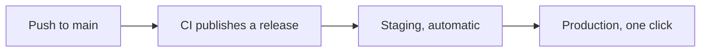

# Developers

Your application lives in its own repository. You push; the platform builds, deploys, and keeps it running.

[:material-rocket-launch: Your first release](first-release.md){ .md-button .md-button--primary }

## What you do

| Step | When | Guide |
|---|---|---|
| Bring your repository to the platform | Once | [Onboard a repository](onboarding.md) |
| Store credentials | When they change | [Secrets](secrets.md) |
| Publish a release | Every push | [Continuous integration](ci.md) |
| Send it to production, or take it back | Every release | [Releases and rollback](releases.md) |
| See how it behaves | Any time | [Observability](observability.md) |
| Keep its data safe | Once per volume or database | [Data and backups](data.md) |

!!! info "Who owns what"

    | You | The platform |
    |---|---|
    | Code, tests, `Dockerfile` | Runners, controllers, dashboards |
    | Manifests in `deploy/` | Namespaces and permissions |
    | Your encrypted secrets | Promotion and rollback |
