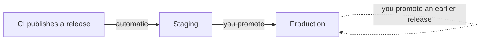

# Releases and rollback



## Promote to production

1. Open your project in [Kargo](https://kargo.localhost:8443/).
2. On **production**, click the truck icon and choose **Promote**.
3. Click **Select** on the release that staging runs.
4. Review the image and the commit, then click **Promote**.

<video controls preload="metadata" src="../../videos/promote-a-release-to-production.mp4"></video>

## Roll back

1. Open your project in Kargo.
2. On **production**, click the truck icon and choose **Promote**.
3. Click **Select** on an earlier release.
4. Click **Promote**.

<video controls preload="metadata" src="../../videos/roll-production-back-to-an-earlier-release.mp4"></video>

!!! warning "A rollback restores code and configuration, not data"

    Files and database contents stay as they are. See [Data and backups](data.md).

## Check it worked

The **production** box in Kargo shows the release name and **Healthy**.

## Change who promotes

```yaml title="deploy/platform.yaml" hl_lines="4 7"
environments:
  staging:
    path: deploy/staging
    promotion: automatic # (1)!
  production:
    path: deploy/production
    promotion: manual
    from: staging
```

1.  `automatic` promotes every new release. `manual` waits for a person.

## Roll out gradually

Turn a `Deployment` into a canary. The new version takes half the traffic, waits, then takes all of it.

```yaml title="deploy/staging/web-canary.yaml"
- op: replace
  path: /apiVersion
  value: argoproj.io/v1alpha1
- op: replace
  path: /kind
  value: Rollout
- op: replace
  path: /spec/strategy
  value:
    canary:
      maxSurge: 1
      maxUnavailable: 0
      steps:
        - setWeight: 50
        - pause:
            duration: 2m # (1)!
        - setWeight: 100
```

1.  If the new version fails during the pause, the rollout stops and the old one keeps serving.

```yaml title="deploy/staging/kustomization.yaml"
patches:
  - target:
      group: apps
      version: v1
      kind: Deployment
      name: web
    path: web-canary.yaml
```
