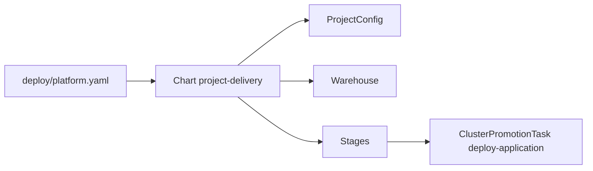

# Delivery

## Discovery and onboarding

{ loading=lazy width="460" }

| ApplicationSet | Creates | From |
|---|---|---|
| `projects` | `<repo>-onboarding`: namespaces, AppProjects, Kargo project | `kubernetes/charts/project-onboarding` |
| `apps-staging` | `<repo>-staging` | Branch `deploy/staging` of the application repository |
| `apps-production` | `<repo>-production` | Branch `deploy/production` of the application repository |

A repository is selected when it has the topic `blackstorm-deploy`, a default branch named `main`
or `master`, and the file `deploy/platform.yaml`.

## From the contract to Kargo

The application declares what it releases. The platform generates how it is promoted.



| Generated | From the contract |
|---|---|
| `ProjectConfig` | `promotion` of each environment |
| `Warehouse` | `images` and `releaseFormat` |
| `Stage` | `path` and `from` of each environment |

```yaml title="kubernetes/charts/project-onboarding/templates/kargo.yaml"
sources:
  - repoURL: git@github.com:blackstorm-dev/blackstorm-template.git
    path: kubernetes/charts/project-delivery
    helm:
      valueFiles:
        - $project/deploy/platform.yaml # (1)!
  - repoURL: <application repository>
    ref: project
    path: secrets/platform # (2)!
```

1.  The contract is validated against `values.schema.json` when the chart renders.
2.  The credentials Kargo needs to read the application images.

## Continuous integration

{ loading=lazy }

| Component | Role |
|---|---|
| GitHub Actions | Queues the jobs |
| ARC controller and listener | Create one runner per job and remove it afterwards |
| Runner pod | Checks out, decrypts with SOPS, builds with Docker-in-Docker |

## Promotion

{ loading=lazy width="460" }

```yaml title="kubernetes/apps/kargo/kargo/deploy-application.yaml"
steps:
  - uses: git-clone # (1)!
  - uses: git-clear
  - uses: kustomize-set-image # (2)!
  - uses: kustomize-build
  - uses: git-commit
  - uses: git-push # (3)!
  - uses: argocd-update # (4)!
```

1.  The validated commit, and the output branch `deploy/<stage>`.
2.  Pins every image of the release by digest.
3.  The rendered manifests go to the output branch.
4.  Points the Argo CD application to that commit and waits for the sync.

## Release formats

| `releaseFormat` | Git tag | Image tag |
|---|---|---|
| `coordinated-tags`, the default | `blackstorm-ci-<run>-<attempt>` | The same as the Git tag |
| `commit-sha` | `ci-<run>-<attempt>-<commit-sha>` | `<commit-sha>` |

Freight is created only when the Git tag and every image of the release exist.
