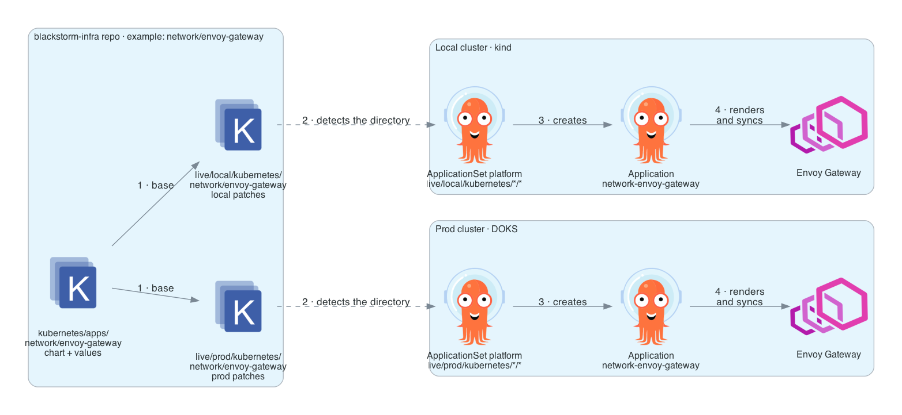
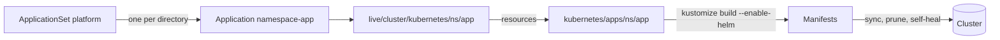

# GitOps

{ loading=lazy }

## Layout

```text
bootstrap/helmfile.yaml                  # Argo CD and the secrets operator, before GitOps exists
kubernetes/apps/<namespace>/<app>/       # each component, defined once: chart and values
live/<cluster>/kubernetes/
├── appproject.yaml                      # project "platform"
├── applicationset.yaml                  # one Application per directory below
└── <namespace>/<app>/kustomization.yaml # "this component runs here", plus cluster patches
```

## From a directory to the cluster



```yaml title="live/local/kubernetes/applicationset.yaml"
generators:
  - git:
      repoURL: git@github.com:blackstorm-dev/blackstorm-template.git
      revision: main
      directories:
        - path: live/local/kubernetes/*/* # (1)!
template:
  metadata:
    name: "{{ index .path.segments 3 }}-{{ .path.basename }}" # (2)!
  spec:
    syncPolicy:
      automated:
        prune: true
        selfHeal: true
```

1.  Every directory at this depth becomes an Application.
2.  `<namespace>-<app>`, for example `network-envoy-gateway`.

## Recipes

| Goal | Change |
|---|---|
| Run a new component | Add `kubernetes/apps/<ns>/<app>/` and `live/<cluster>/kubernetes/<ns>/<app>/kustomization.yaml` |
| Stop running a component in a cluster | Delete `live/<cluster>/kubernetes/<ns>/<app>/` |
| Change something in one cluster only | Add a patch to that cluster's `kustomization.yaml` |
| Upgrade a component | Change the chart version in `kubernetes/apps/<ns>/<app>/kustomization.yaml` |

```yaml title="live/local/kubernetes/velero/velero-ui/kustomization.yaml"
apiVersion: kustomize.config.k8s.io/v1beta1
kind: Kustomization
resources:
  - ../../../../../kubernetes/apps/velero/velero-ui # (1)!
  - httproute.yaml # (2)!
```

1.  The shared definition.
2.  What only this cluster adds.

??? tip "Make Argo CD read the repository now"

    It checks every three minutes. To force it:

    ```bash
    kubectl --context local -n argocd annotate applicationset platform \
      argocd.argoproj.io/application-set-refresh=true --overwrite
    ```
