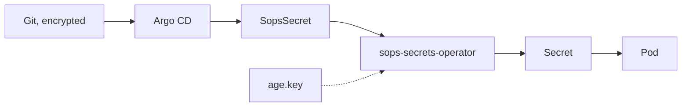

# Secrets

{ loading=lazy }

## Where they live

| Path | Format | Read by |
|---|---|---|
| `live/<environment>/secrets/*.env` | Environment file | Terraform, through Make |
| `live/<environment>/secrets/**/*.yaml` | `SopsSecret` | The cluster |
| `age.key` | Private key, ignored by Git | You, and the secrets operator |
| `live/<environment>/deploy.key` | SSH key, ignored by Git | Argo CD |

## Edit

```bash
sops live/prod/secrets/digitalocean.env # (1)!
```

1.  Opens the editor and encrypts again on save.

| Variable in a `.env` file | Becomes |
|---|---|
| Provider credential, for example `DIGITALOCEAN_TOKEN` | The variable the provider expects |
| `TF_VAR_<name>` | `var.<name>` in Terraform |

## In the cluster



## Situations

| Situation | Action |
|---|---|
| New machine | Copy `age.key` to the repository root, then `make init` |
| Rotate a token | Create the new one, `sops <file>`, revoke the old one |
| The hook rejects a commit | The file is in plain text: `sops -e -i <file>` |
| `age.key` is lost | New key, its public part in `.sops.yaml`, new credentials, re-encrypt everything |

!!! warning "Rotating is not re-encrypting"

    Earlier versions of a file stay in Git history. A leaked credential must be revoked.
