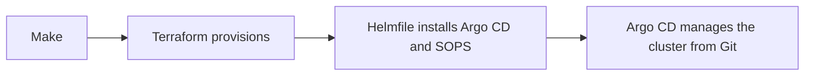

# Operators

This repository manages the platform. Applications live in their own repositories.

-   :material-flash:{ .lg .middle } [Quick start](quick-start.md)

    ---

    From a clean machine to a running cluster.

-   :material-sitemap:{ .lg .middle } [Architecture](architecture/index.md)

    ---

    GitOps, networking, and secrets.

-   :material-wrench:{ .lg .middle } [Operations](operations.md)

    ---

    Commands, components, and dependency updates.

-   :material-backup-restore:{ .lg .middle } [Recovery](recovery.md)

    ---

    What is backed up, where, and how to check it.

