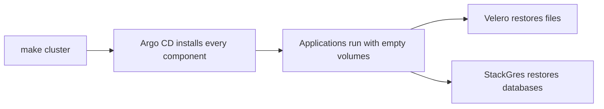

# Recovery

{ loading=lazy }

## Who recovers what

| Lost | Recovered by | From |
|---|---|---|
| Component and application definitions | Argo CD | Git |
| Files in volumes | Velero | Spaces |
| PostgreSQL | StackGres | Spaces |

Argo CD brings an application back with empty volumes. Velero and StackGres bring back the data.

## Rebuild a cluster



## Velero

```yaml title="live/local/kubernetes/velero/velero/schedule.yaml"
apiVersion: velero.io/v1
kind: Schedule
metadata:
  name: local-daily
  namespace: velero
spec:
  schedule: "0 6 * * *" # (1)!
  template:
    ttl: 168h0m0s # (2)!
    includedNamespaces: ["*"]
    excludedNamespaces: [velero, kube-system, kube-public, kube-node-lease]
    includeClusterResources: true
    defaultVolumesToFsBackup: false # (3)!
```

1.  Every day at 06:00 UTC.
2.  Backups expire after seven days.
3.  Only volumes named in the Pod annotation `backup.velero.io/backup-volumes` are copied.

| Setting | Value |
|---|---|
| Bucket | `blackstorm-backups` |
| Prefix | `<cluster>/velero` |
| Uploader | kopia |

## Check the backups

```bash
kubectl --context local -n velero get schedules
kubectl --context local -n velero get backups
kubectl --context local -n velero get podvolumebackups
```

Or open [Velero UI](https://velero.localhost:8443/) and [StackGres](https://stackgres.localhost:8443/).

!!! warning "Restores are manual"

    A restore is started by a person, from Velero UI or StackGres. Restores are not tested on a
    schedule.
