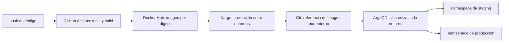

# Fase 4 · Alta autoservicio de proyectos

## Objetivo

Un dev crea un repo a partir de nuestra plantilla, define la app y sus entornos y puede desplegar
sin editar el repo de infraestructura en cada proyecto o release. Los repos y la plataforma están
administrados por Blackstorm. La CI no recibe credenciales de Kubernetes.

## Estado y acuerdos

Elegimos **GitHub Actions con runners propios** para esta etapa, después de
[comparar Actions, Jenkins y Tekton](04-evaluacion-ci.md). Los proyectos pueden adaptar sus workflows;
la plataforma ofrece piezas reutilizables. La validación del runner propio sigue pendiente.

- Organización GitHub: `blackstorm-dev`. `blackstorm-infra` ya fue transferido; ArgoCD local y prod
  leen la nueva URL. Las deploy keys están habilitadas en la organización.
- Repo piloto y template: `blackstorm-dev/project-template`, creado como privado y GitHub template. Su checkout vive en `projects/project-template/`,
  ignorado por el repo de infraestructura, con su propio `.git`. No es un submódulo.
- El piloto local ya contiene una app HTTP mínima, tests, Dockerfile y workflow de GitHub Actions.
  Los tests locales pasan. Falta configurar Docker Hub y validar tests → build → imagen en GitHub Actions.
- El primer runner local se prepara con ARC; [setup y prueba](../architecture/05-github-actions-runners.md).
  La GitHub App está instalada y su Secret cifrado ya se cargó en local. Falta publicar los cambios
  revisados, sincronizar ARC y ejecutar el job remoto.
- GitHub Actions hace CI. ArgoCD aplica el estado deseado al cluster. Evaluaremos Kargo con el
  piloto para gestionar la promoción de imágenes entre entornos.
- Un proyecto puede necesitar staging y producción en el mismo cluster `prod`, con namespaces
  separados. Los entornos de la app no equivalen a los clusters `live/local` y `live/prod`.
- La imagen se identifica por digest. La promoción debe reutilizar la misma imagen probada;
  no reconstruirla para cada entorno.

Kargo, el descubrimiento de repos y el contrato de despliegue todavía no están implementados.
Las propuestas siguientes deben validarse paso a paso con el piloto.

## Primer paso: repo piloto y CI

1. Validar el runner propio local: GitHub App, credencial con SOPS, ARC y `runner-check.yaml`.
   El repo privado `blackstorm-dev/project-template` ya existe y está marcado como template.
2. Preparar herramientas y builder del runner; adaptar el workflow del piloto, que hoy usa `ubuntu-latest`.
3. Configurar la variable `DOCKERHUB_NAMESPACE` y los secrets `DOCKERHUB_USERNAME` y `DOCKERHUB_TOKEN`.
   Crear el repositorio correspondiente en Docker Hub y definir su visibilidad.
4. Ejecutar la CI en GitHub: los PR corren tests; los pushes a `main` prueban, construyen y publican
   una imagen con tag del commit. El resumen del workflow registra la referencia por digest.
5. Comprobar que la imagen publicada arranca y responde al health check.

Este paso no crea namespaces de proyectos ni despliega la app. El mismo repo se ampliará con el contrato de
entornos y despliegue después de validar la publicación de imágenes.

## Diseño de entornos y promoción: pendiente de cerrar

Para el piloto proponemos staging y producción, cada uno en su namespace. Falta decidir si serán
entornos preestablecidos que el proyecto selecciona o si el repo podrá declarar otros nombres.
También faltan el formato de esa declaración y la estructura de los manifiestos bajo `deploy/`.

El recorrido a validar es:

La propuesta es probar la imagen en staging y promover ese mismo digest a producción. Falta definir
qué verifica staging, cómo se inicia la promoción a producción y cómo se hace rollback. El push a
`main` no se considera por sí solo una orden de desplegar directamente a producción.

## Alta de proyectos: propuesta

La plataforma debe resolver una vez el acceso a los repos, su descubrimiento y la creación de los
recursos administrativos. Después, incorporar un proyecto no debería requerir agregar una carpeta
específica a `blackstorm-infra`.

- **Acceso:** GitHub App para que ArgoCD descubra y lea los repos autorizados. La deploy key de
  `blackstorm-infra` sigue sirviendo para infraestructura. Los permisos de escritura necesarios
  para Kargo se definirán al diseñar la promoción.
- **Habilitación:** se propuso el topic `blackstorm-deploy` como marca para que un ApplicationSet
  descubra el repo. Es un mecanismo pendiente de validar, no una herramienta de CI ni un control
  de acceso suficiente por sí solo. El repo template no debe desplegarse por existir en la org.
- **Recursos administrativos:** la plataforma crea namespaces, cuotas, límites, políticas de red
  y permisos de ArgoCD a partir de una plantilla fija y de los entornos habilitados.
- **Despliegue:** una Application por entorno lee sus manifiestos del repo del proyecto y queda
  limitada al namespace y tipos de recurso permitidos. El repo del dev no se renderiza con
  permisos de administración de plataforma.
- **Baja:** dejar de descubrir un repo no debe borrar automáticamente namespaces, PVC ni datos.
  La baja debe ser una operación explícita.

La plantilla administrativa de infraestructura y el repo `project-template` son dos piezas distintas:
la primera define límites de la plataforma; el segundo es el punto de partida del código de las apps.

## Contrato del dev: base propuesta

| Tema | Base para validar con el piloto |
|---|---|
| Código | Repo propio en `blackstorm-dev`, creado desde el template |
| CI | Tests, Dockerfile y publicación de imagen por digest |
| Entornos | Declaración en el repo; formato y catálogo todavía pendientes |
| Manifiestos | Entrada renderizable por entorno bajo `deploy/`; estructura pendiente |
| Namespace | Lo crea la plataforma por proyecto y entorno; el dev no declara `Namespace` |
| App | Probes de readiness/liveness y requests/limits explícitos |
| Red | `HTTPRoute` con hostname asignado al proyecto y entorno; políticas para impedir usar hosts ajenos |
| Secretos | Propuesta: `SopsSecret` cifrado con claves públicas del cluster y del equipo; nunca entregar `age.key` al dev |
| Permisos | Sin kubeconfig para dev o CI; recursos limitados por el `AppProject` |

Falta definir los hostnames por entorno, el manejo del pull secret de Docker Hub y qué recursos
adicionales requiere el primer proyecto: PVC, base de datos, jobs o secretos.

## Orden posterior al primer paso

1. Cerrar el contrato de entornos y promoción con el piloto.
2. Probar Kargo y ArgoCD en local con staging y producción en namespaces separados.
3. Validar promoción del mismo digest, verificación de staging y rollback.
4. Agregar descubrimiento de repos y creación de recursos administrativos; probar aislamiento,
   límites de hostnames y baja sin borrado de datos.
5. Completar la plantilla y la guía del dev con el flujo comprobado.
6. Llevar el piloto a prod después de revisar la capacidad del nodo actual.

## Referencias

- [Kargo: conceptos](https://docs.kargo.io/user-guide/core-concepts)
- [Kargo: stages](https://docs.kargo.io/user-guide/how-to-guides/working-with-stages)
- [ArgoCD: SCM Provider Generator](https://argo-cd.readthedocs.io/en/latest/operator-manual/applicationset/Generators-SCM-Provider/)
- [ArgoCD: AppProject y credenciales de repos](https://argo-cd.readthedocs.io/en/stable/operator-manual/declarative-setup/)
- [Gateway API: seguridad de rutas compartidas](https://gateway-api.sigs.k8s.io/docs/concepts/security/)
