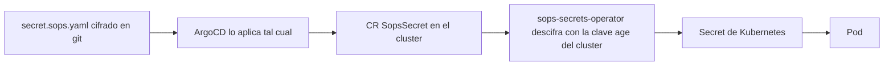
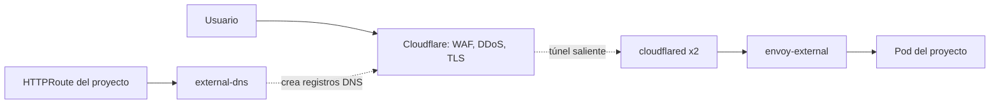
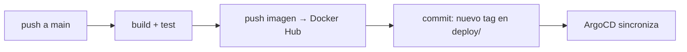

# Plan de la plataforma

Cluster Kubernetes en DigitalOcean para desplegar todos los proyectos de la consultora,
de forma automatizada (GitOps) y segura. Un solo cluster puede alojar varios entornos de un
proyecto, con un namespace separado por proyecto y entorno.

Referencia de estructura: [onedr0p/home-ops](https://github.com/onedr0p/home-ops) y
[onedr0p/cluster-template](https://github.com/onedr0p/cluster-template). De ahí se toma la
capa GitOps (`kubernetes/`); la capa de bootstrap de nodos (Talos, Cilium, rook-ceph) no aplica
porque DOKS ya provee control plane, red, storage y balanceo.

## 1. Principios

- **Terraform maneja lo que está fuera del cluster**: DOKS, Cloudflare, buckets.
- **ArgoCD maneja lo que corre adentro**: plataforma y proyectos. Nada se aplica a mano con `kubectl`.
- **Todo en git, cifrado lo que haga falta**: SOPS + age. Ningún secreto en texto plano en el repo.
- **Cada carpeta de app es autocontenida**: chart + values + secretos + recursos extra en un solo lugar.
- **El código de los proyectos vive en su propio repo**. Este repo solo dice dónde y cómo corre.
- **Corte por cluster**: `live/<env>/` tiene todo lo que existe para ese cluster (`terraform/`, `secrets/`, `kubernetes/`). `terraform/` y `kubernetes/apps/` son planos compartidos. Hoy `prod` y `local`. Los entornos de una app, como staging y producción, pueden compartir el cluster `prod` usando namespaces distintos; no requieren copiar `live/prod/`.

## 2. Herramientas: decisiones

| Área | Herramienta | Decisión | Notas |
|---|---|---|---|
| Cloud | Terraform + provider DigitalOcean | ✅ | `terraform/resources/<provider>/`: un recurso por carpeta, sin opiniones; `terraform/modules/`: cómo armamos cada cosa (composición + opiniones) |
| Orquestación de Terraform | Terragrunt | ✅ | `live/<env>/terraform/<unidad>/terragrunt.hcl`: módulo + valores; backend una vez en `live/root.hcl`; un state por unidad; crea el bucket del state (`backend bootstrap`); `run --all` |
| Cluster | DOKS | ✅ | control plane gratis, sin HA |
| Cluster local | kind (Kubernetes upstream en Docker), provider `tehcyx/kind` | ✅ | `live/local/terraform/cluster`; mismo flujo Terragrunt, state en disco. Solo para probar `kubernetes/` |
| Bootstrap del cluster | helmfile | ✅ | instala ArgoCD + sops-secrets-operator una sola vez, después ArgoCD se gestiona a sí mismo |
| GitOps | ArgoCD | ✅ | ApplicationSets por carpeta; AppProject por proyecto |
| CI de proyectos | GitHub Actions + runners propios | ✅ elegida; 🔧 piloto pendiente | [Evaluación](04-evaluacion-ci.md); ARC local y GitHub App como primer hito; después tests → build → imagen por digest |
| Promoción de proyectos | Kargo | 📋 evaluar con el piloto | promover la misma imagen entre entornos; contrato pendiente en [fase 4](04-alta-de-proyectos.md) |
| Secretos en git | SOPS + age | ✅ | secreto cero (tokens de DO y Cloudflare, clave age) |
| Secretos en el cluster | sops-secrets-operator | ✅ | ArgoCD aplica el `SopsSecret` cifrado; el operador genera el `Secret`. Sin plugins en ArgoCD |
| Bóveda externa | 1Password + external-secrets | ⏸ | no es open source, es pago. No hace falta hoy; ver §9 |
| Gateway | Envoy Gateway (Gateway API) | ✅ | dos gateways: `envoy-external` (público) y `envoy-internal` |
| Entrada pública | Cloudflare Tunnel (cloudflared) | ✅ | sin Load Balancer de DO, origen sin IP pública |
| **DNS** | **external-dns → Cloudflare** | ✅ | crea/borra registros DNS a partir de los `HTTPRoute`. Ver §6 |
| TLS | cert-manager + Let's Encrypt (DNS-01 Cloudflare) | ✅ | wildcard del dominio |
| Postgres | CloudNativePG (CNPG) | ✅ | Postgres dentro del cluster, un `Cluster` por proyecto; backups propios a Spaces con PITR |
| Backups de volúmenes | Kopiur | ✅ | repo kopia en Spaces; restore automático de PVCs. Velero descartado |
| Observabilidad | kube-prometheus-stack (Prometheus, Alertmanager, Grafana) | ✅ | logs con Loki + Alloy en una segunda etapa |
| Registry de imágenes | Docker Hub (cuenta Pro existente) | ✅ | sin Terraform; pull secret por namespace en `kubernetes/components/dockerhub-pull` (fase 4); token de push en la CI de cada proyecto |
| Versiones de herramientas | mise | ✅ | terraform, terragrunt, kubectl, helm, helmfile, sops, age, argocd, kubeconform |
| Tareas | Makefile | ✅ | `make init`, `make connect ENV=<env>`, `make cluster ENV=<env>`, `make infra-plan/infra-apply ENV=<env> [UNIT=x]`, `make docs-diagram`. Imprime el comando real; apply pide confirmación |
| Hooks de git | lefthook | ✅ | pre-commit: ningún `*.sops.*` sin cifrar; `terraform fmt`; `terragrunt hcl fmt`; kubeconform |
| Actualizaciones | Renovate | ✅ | PRs por versiones de charts, imágenes y providers |
| CI del repo de infra | GitHub Actions | ✅ | `terragrunt run --all plan` en PR, `apply` en merge, validación de manifests |
| Descartado | Talos, Cilium, rook-ceph, spegel, Flux, Velero, KeePass, Longhorn, ingress-nginx | ❌ | DOKS lo provee, o se eligió otra cosa |

## 3. Estructura del repo

```
blackstorm-cluster/
├── .sops.yaml                 # qué se cifra y con qué claves age
├── mise.toml                  # versiones fijas de las herramientas; KUBECONFIG=.kube/* dentro del repo
├── .kube/                     # kubeconfigs generados (make connect), ignorado por git
├── .lefthook.toml             # hooks pre-commit
├── .renovaterc.json5
├── .github/workflows/         # CI del repo de infra
├── Makefile
├── docs/
│   ├── plans/plan.md          # este documento
│   ├── architecture/          # una doc por fase: qué existe, flujos, cómo operar
│   └── resources/             # diagramas generados (make docs-diagram), referencias
├── age.key                    # LA clave de sops (la genera make init; ignorada por git; hacele backup)
├── terraform/                 # planos, sin entornos
│   ├── resources/             # un recurso por carpeta, sin opiniones, agrupados por provider
│   │   ├── digitalocean/      #   spaces-bucket, kubernetes-cluster, vpc, ...
│   │   ├── cloudflare/        #   zone, tunnel, access
│   │   ├── github/            #   deploy-key, webhook
│   │   └── kind/              #   cluster
│   └── modules/               # cómo armamos cada cosa con resources/ (backups, doks, kind, argocd, cloudflare, ...)
├── live/                      # lo que existe, por entorno
│   ├── root.hcl               # backend del state (Spaces), heredado por todas las unidades
│   ├── prod/
│   │   ├── terraform/         #   una unidad Terragrunt por cosa, un state por unidad
│   │   │   ├── backups/terragrunt.hcl
│   │   │   ├── cluster/terragrunt.hcl
│   │   │   ├── argocd/terragrunt.hcl
│   │   │   └── cloudflare/terragrunt.hcl
│   │   ├── deploy.key         #   llave con la que este cluster lee el repo (gitignored; la genera make)
│   │   ├── secrets/           #   cifrado con SOPS: un .env por proveedor
│   │   │   ├── digitalocean.env
│   │   │   └── cloudflare.env
│   │   └── kubernetes/        #   lo que cambia por cluster (fase 2)
│   └── local/
│       ├── terraform/
│       │   ├── root.hcl       #   pisa al de live/: state en disco
│       │   ├── cluster/terragrunt.hcl
│       │   └── argocd/terragrunt.hcl
│       ├── secrets/           #   GitHub App de ARC cifrada con SOPS
│       └── kubernetes/
├── bootstrap/
│   ├── helmfile.yaml          # ArgoCD + sops-secrets-operator
│   └── age-secret.sops.yaml   # la clave age como Secret de k8s (se aplica una vez)
└── kubernetes/                # compartido por todos los clusters; lo que cambia por cluster va en live/<env>/kubernetes/
    ├── argocd/                # ApplicationSets + AppProject "platform"
    │   ├── platform.yaml      # una Application por kubernetes/apps/*/*
    │   └── projects.yaml      # una Application por kubernetes/projects/*
    ├── components/            # kustomize components reutilizables (kopiur, alerts, netpol base)
    ├── apps/                  # plataforma: <namespace>/<app>/
    │   ├── argocd/argocd/     # ArgoCD se gestiona a sí mismo después del bootstrap
    │   ├── sops-secrets-operator/sops-secrets-operator/
    │   ├── cert-manager/cert-manager/
    │   ├── network/
    │   │   ├── envoy-gateway/
    │   │   ├── cloudflared/
    │   │   └── external-dns/
    │   ├── cnpg-system/cloudnative-pg/
    │   ├── kopiur-system/kopiur/
    │   └── o11y/
    │       ├── kube-prometheus-stack/
    │       └── grafana-dashboards/
    └── project-template/       # recursos administrativos renderizados por cada repo habilitado
        ├── namespace.yaml
        ├── appproject.yaml     # límites: solo su namespace, solo su repo
        ├── resourcequota.yaml
        └── networkpolicy.yaml
```

### Mapeo con home-ops

| home-ops (Flux) | acá (ArgoCD) |
|---|---|
| `kubernetes/flux/cluster/` | `kubernetes/argocd/` (ApplicationSets) |
| `<app>/ks.yaml` (Flux Kustomization) | generado por el ApplicationSet, no se escribe |
| `<app>/app/helmrelease.yaml` | `helmCharts:` en el `kustomization.yaml` de la app |
| `<app>/app/externalsecret.yaml` | `<app>/secret.sops.yaml` (`SopsSecret`) |
| `<namespace>/namespace.yaml` | ArgoCD lo crea (`CreateNamespace=true`) |
| `bootstrap/helmfile` (Cilium, CoreDNS, Flux) | `bootstrap/helmfile.yaml` (ArgoCD, sops-secrets-operator) |
| `talos/` | `live/prod/terraform/cluster` (módulo `doks`) |

### Una app de plataforma

```
kubernetes/apps/cert-manager/cert-manager/
├── kustomization.yaml     # helmCharts + resources
├── values.yaml
├── clusterissuer.yaml
└── secret.sops.yaml       # token de Cloudflare para DNS-01, cifrado
```

```yaml
# kustomization.yaml
apiVersion: kustomize.config.k8s.io/v1beta1
kind: Kustomization
namespace: cert-manager
helmCharts:
  - name: cert-manager
    repo: https://charts.jetstack.io
    version: v1.18.2          # Renovate lo actualiza
    releaseName: cert-manager
    valuesFile: values.yaml
resources:
  - clusterissuer.yaml
  - secret.sops.yaml
```

ArgoCD necesita `kustomize.buildOptions: --enable-helm` en `argocd-cm` para inflar charts desde kustomize.

## 4. ArgoCD

### Bootstrap (una vez)

```
make bootstrap
  1. kubectl create secret sops-age --from-file=age.key        ← la misma clave del repo, para el operador
  2. helmfile -f bootstrap/helmfile.yaml apply   → ArgoCD + sops-secrets-operator
  3. kubectl apply -f kubernetes/argocd/         → ApplicationSets
```

Desde ahí ArgoCD sincroniza `kubernetes/` y se gestiona a sí mismo (`kubernetes/apps/argocd/argocd/`
con el mismo chart y values que el helmfile).

### ApplicationSet de plataforma

```yaml
apiVersion: argoproj.io/v1alpha1
kind: ApplicationSet
metadata:
  name: platform
  namespace: argocd
spec:
  generators:
    - git:
        repoURL: https://github.com/<org>/blackstorm-cluster
        revision: main
        directories:
          - path: kubernetes/apps/*/*
  template:
    metadata:
      name: "{{path[2]}}-{{path.basename}}"    # namespace-app
    spec:
      project: platform
      source:
        repoURL: https://github.com/<org>/blackstorm-cluster
        targetRevision: main
        path: "{{path}}"
      destination:
        server: https://kubernetes.default.svc
        namespace: "{{path[2]}}"
      syncPolicy:
        automated: { prune: true, selfHeal: true }
        syncOptions: [CreateNamespace=true, ServerSideApply=true]
```

Orden entre apps (CRDs antes que quien los usa): anotación `argocd.argoproj.io/sync-wave` en cada app.

### ApplicationSet de proyectos

El diseño de la fase 4 está en [04-alta-de-proyectos.md](04-alta-de-proyectos.md): se propone descubrir
repos habilitados en GitHub, crear los namespaces y límites de sus entornos y sincronizar los
manifiestos de cada entorno con un `AppProject` restringido. El dev no edita este repo para cada
despliegue. El contrato de entornos y la integración con Kargo todavía deben validarse con el piloto.

## 5. Secretos

### Claves

Una sola clave para todo, como en cluster-template: `age.key` en la raíz del repo (ignorada por git).

| Quién | Cómo la tiene |
|---|---|
| Vos / cualquier dev | el archivo `age.key`; `make init` lo genera si no existe, mise apunta `SOPS_AGE_KEY_FILE` a él |
| Cluster (sops-secrets-operator) | Secret `sops-age` creado en el bootstrap desde ese mismo archivo |
| CI (GitHub Actions) | secret `SOPS_AGE_KEY` con el contenido del archivo |

Perder `age.key` = no poder descifrar `secrets/`. Backup fuera del repo.

### `.sops.yaml`

```yaml
creation_rules:
  - path_regex: secrets/.*
    age: age1<vos>,age1<ci>
  - path_regex: bootstrap/.*\.sops\.ya?ml$
    encrypted_regex: ^(data|stringData)$
    age: age1<vos>
  - path_regex: kubernetes/.*\.sops\.ya?ml$
    encrypted_regex: ^(data|stringData)$
    age: age1<vos>,age1<cluster>
```

### Flujo en el cluster



```yaml
# antes de cifrar con: sops -e -i secret.sops.yaml
apiVersion: isindir.github.com/v1alpha3
kind: SopsSecret
metadata:
  name: cloudflare-api-token
spec:
  secretTemplates:
    - name: cloudflare-api-token
      stringData:
        api-token: cf_xxx
```

En git solo `stringData` queda cifrado; nombre y estructura se leen. Editar: `sops secret.sops.yaml`.

### Terraform

```
make infra-plan ENV=prod UNIT=cluster   # carga live/prod/secrets/*.env y corre terragrunt
```

Nada en texto plano en disco. El hook de lefthook rechaza el commit si un `*.sops.*` o algo en
`secrets/` no está cifrado.

## 6. Red, DNS y entrada pública



- **Sin Load Balancer**: cloudflared abre la conexión desde el cluster hacia Cloudflare. El cluster no
  escucha nada desde internet. Ahorra ~USD 12/mes.
- **Túnel creado por Terraform** (`live/prod/terraform/cloudflare`): el token sale como output y
  `make bootstrap ENV=prod` lo carga en el Secret `cloudflared-token` del cluster.
- **cloudflared** reenvía `*.<dominio>` → Service de `envoy-external`.

### external-dns: sincronizador de registros DNS

Es la pieza que hace que publicar una app ya habilitada sea **solo commitear un `HTTPRoute`**.

1. El proyecto define en su repo un `HTTPRoute` con el hostname que le corresponde, por ejemplo
   `proyecto.blackstorm.dev`, enganchado al gateway `envoy-external`. La fase 4 agrega una política que
   impide reclamar hostnames de otros proyectos.
2. external-dns (source `gateway-httproute`) lo ve y crea en Cloudflare un **CNAME proxied**
   `proyecto.blackstorm.dev → tunnel.blackstorm.dev`. El target sale de la anotación
   `external-dns.kubernetes.io/target` puesta en el Gateway.
3. Se borra el `HTTPRoute` → se borra el registro. Los registros gestionados llevan un `TXT` de
   ownership: external-dns no toca registros que no creó él.
4. Apps enganchadas a `envoy-internal` no reciben DNS público.

Configuración clave de external-dns:

```yaml
provider: cloudflare
sources: [gateway-httproute, gateway-grpcroute]
policy: sync
txtOwnerId: blackstorm
extraArgs:
  - --cloudflare-proxied
  - --gateway-name=envoy-external     # solo el gateway público
```

### Acceso a paneles internos

ArgoCD, Grafana y cualquier UI de administración salen por `envoy-external` **detrás de Cloudflare
Access** (zero trust, gratis hasta 50 usuarios): login con tu cuenta antes de llegar al cluster.

### TLS

cert-manager con `ClusterIssuer` Let's Encrypt, challenge **DNS-01 vía Cloudflare**: un certificado
wildcard por dominio, sin exponer nada. Entre Cloudflare y el gateway el tráfico va cifrado por el túnel.

## 7. Datos: Postgres y backups

### Postgres dentro del cluster: CloudNativePG

- Operador en `cnpg-system`. Cada proyecto declara su propio `Cluster` en su namespace
  (1 instancia al principio, 2 con réplica cuando importe).
- **Backups nativos de CNPG** con el plugin barman-cloud → bucket en DO Spaces: base backup
  programado + archivado continuo de WAL = **restore a un punto en el tiempo**.
- Restore = nuevo `Cluster` con `bootstrap.recovery` apuntando al backup. Se prueba periódicamente
  en un namespace aparte.

Patrón (tomado de home-ops, actualizado al plugin Barman Cloud):

```yaml
# un ObjectStore por proyecto, apunta a Spaces
apiVersion: barmancloud.cnpg.io/v1
kind: ObjectStore
metadata: { name: <proyecto>-backups }
spec:
  configuration:
    destinationPath: s3://blackstorm-backups/<proyecto>/
    endpointURL: https://nyc3.digitaloceanspaces.com
    s3Credentials: { accessKeyId: {...}, secretAccessKey: {...} }   # SopsSecret
  retentionPolicy: 30d
---
apiVersion: postgresql.cnpg.io/v1
kind: Cluster
metadata: { name: <proyecto>-pg-v1 }
spec:
  instances: 1
  plugins:
    - name: barman-cloud.cloudnative-pg.io
      isWALArchiver: true                       # WAL continuo → PITR
      parameters: { barmanObjectName: <proyecto>-backups }
  # --- restore: se descomenta, se sube el sufijo -v1 → -v2 y se commitea ---
  # bootstrap:
  #   recovery:
  #     source: previous
  #     recoveryTarget: { targetTime: "2026-09-26 03:00:00+00" }   # opcional
  # externalClusters:
  #   - name: previous
  #     plugin:
  #       name: barman-cloud.cloudnative-pg.io
  #       parameters: { barmanObjectName: <proyecto>-backups, serverName: <proyecto>-pg-v1 }
---
apiVersion: postgresql.cnpg.io/v1
kind: ScheduledBackup
spec:
  schedule: "0 0 3 * * *"                       # diario 03:00 (formato de 6 campos)
  immediate: true
  method: plugin
  pluginConfiguration: { name: barman-cloud.cloudnative-pg.io }
  cluster: { name: <proyecto>-pg-v1 }
```

El restore es un commit: CNPG crea el cluster nuevo lleno desde el bucket y sigue respaldando
bajo el nombre nuevo. El viejo se borra cuando se verificó.
- Kopiur **no** respalda los volúmenes de Postgres: un snapshot de disco de una DB en uso no es
  consistente; eso lo resuelve CNPG.

### Volúmenes: Kopiur

- Repo kopia en Spaces (`live/prod/terraform/backups`).
- `SnapshotSchedule` por PVC (uploads, archivos, configs). Se agrega al proyecto con un kustomize
  component (`kubernetes/components/kopiur`).
- `Restore` como volume populator: al recrear un PVC, nace con su último backup, sin intervención.
- Estado del proyecto: **alpha** (`v1alpha1`). Reglas: versión fijada (Renovate abre el PR, se mergea
  leyendo el changelog), restores de prueba periódicos, `RepositoryReplication` a un segundo bucket
  más adelante. Los datos quedan en formato kopia estándar: recuperables con `kopia` CLI aunque el
  operador desaparezca.

## 8. Observabilidad

- `kube-prometheus-stack` en `o11y`: Prometheus, Alertmanager, Grafana, node-exporter,
  kube-state-metrics. Dashboards y reglas por app en su carpeta (`prometheusrule.yaml`,
  `grafanadashboard.yaml`), como en home-ops.
- Alertas a Telegram (o Pushover): nodo caído, pod en CrashLoop, PVC lleno, certificado por vencer,
  backup fallido, CNPG sin réplica.
- Segunda etapa: Loki + Alloy para logs centralizados.
- Retención corta (7-15 días) para no comer disco.

## 9. Bóveda externa: 1Password

- **No es open source ni gratis.** Cliente y SDKs sí son abiertos; el servicio es pago (desde
  ~USD 3/usuario/mes). external-secrets se integra con el provider **1Password SDK** usando un
  service account, sin el servidor Connect.
- **No hace falta hoy**: con SOPS todos los secretos ya están en git cifrados y versionados.
- Tiene sentido cuando: haya un equipo, un cliente necesite gestionar sus propios secretos, o se
  quiera rotar sin commit. En ese momento se suma `external-secrets` y los `SopsSecret` de proyectos
  pasan a `ExternalSecret`, sin cambiar nada más.
- Alternativas open source con provider en external-secrets: Infisical (self-hosted en el cluster),
  OpenBao.

## 10. Flujos de CI

### Repo de un proyecto



La CI del proyecto **nunca tiene acceso al cluster**: solo un token de push al registry. ArgoCD
hace el deploy desde git.

### Repo de infra

| Evento | Acción |
|---|---|
| PR | `terraform fmt -check`, `terragrunt hcl fmt --check`, `terragrunt run --all plan` (comentado en el PR), kubeconform sobre `kubernetes/`, chequeo de cifrado |
| merge a main | `terragrunt apply` de la unidad que cambió; ArgoCD aplica `kubernetes/` solo |
| Renovate | PRs semanales con versiones nuevas; los `patch` de plataforma se pueden automergear, Kopiur y CNPG nunca |

State remoto en un bucket de Spaces (backend S3), sin lock (Spaces no lo soporta; un operador a la vez). El bucket lo administra Terragrunt (`remote_state` en `root.hcl`, creado con `terragrunt backend bootstrap`).

## 11. Capacidad y costo

| Recurso | Costo/mes |
|---|---|
| Control plane DOKS | 0 |
| Nodos: 2 × `s-2vcpu-4gb` (mínimo para plataforma + o11y + CNPG) | ~48 |
| Spaces (tfstate, backups) | 5 |
| Load Balancer | 0 (túnel) |
| **Total** | **~53** |

Con un solo nodo `s-1vcpu-2gb` (~12) no entra la plataforma completa; sirve solo para las fases
0-3.

## 12. Fases

| # | Fase | Contenido | Estado |
|---|---|---|---|
| 0 | Base | `terraform/modules/doks` + `live/prod/cluster`, Makefile, `docs/` | ✅ |
| 1 | Secretos y tooling | age, `.sops.yaml`, `secrets/`, `mise.toml`, `.lefthook.toml`, Terragrunt (`root.hcl`, `resources/`, `modules/`, `live/prod/`), state remoto | ✅ aplicado 2026-09-26: bucket `blackstorm-tfstate`, bucket `blackstorm-backups`, cluster `blackstorm` (k8s 1.36.3, 1 × s-1vcpu-2gb) |
| 2 | ArgoCD | `live/local/terraform/cluster` (kind) · deploy key por Terraform · `bootstrap/helmfile.yaml` · `kubernetes/apps/{argocd,sops-secrets-operator}` · `live/<env>/kubernetes` · ArgoCD gestionándose a sí mismo | ✅ local y prod, 2026-09-26 |
| 3 | Red y DNS | `live/prod/terraform/cloudflare` (zona, túnel, Access), envoy-gateway, cloudflared, **external-dns**, cert-manager | ✅ local y prod; recursos de prod sincronizados y sanos, falta repetir una prueba de acceso en navegador |
| 4 | Primer proyecto | [alta autoservicio](04-alta-de-proyectos.md): repo template, CI → Docker Hub → digest, entornos, promoción con Kargo y despliegue con ArgoCD | 🔧 `blackstorm-dev/project-template` creado; checkout en `projects/project-template/`; falta configurar Docker Hub y validar CI |
| 5 | Datos | CNPG + backups a Spaces, Kopiur, restores de prueba | |
| 6 | Observabilidad | kube-prometheus-stack, alertas, upgrade de nodos | |
| 7 | Automatización del repo | Renovate, GitHub Actions (plan/apply, kubeconform) | |
| 8 | Endurecimiento | network policies por defecto, Pod Security, requests/limits obligatorios, escaneo de imágenes, Loki | Políticas de red por namespace: pospuestas por ahora |
